## わりと難しいのでmarginとpaddingのおさらい
まずは`margin`と`padding`のおさらいから。

HTMLでは要素に対して内側と外側に余白を持たせることができます。

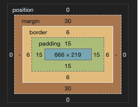

長年エンジニア講師をやってましたが、初学者の方は**大抵ここで混乱してコケます**。<br><br>

なのでかなーり噛み砕いて説明します。

人間と洋服サイズ感に例えてみます。*人間がHTML要素*だと思ってください。

### marginはソーシャルディスタンス？みたいなもの
隣の人とぴったり並んでたら窮屈ですよね。なので少し距離をおきます。

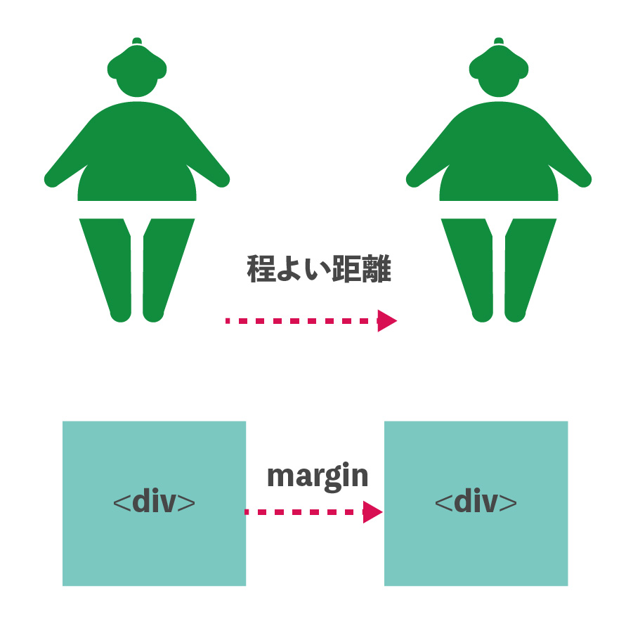

HTMLでは要素と要素の距離を`margin`と言います。イラストでは横方向ですが縦方向にももちろん取れます。<br><br>

`margin`のおもしろい（もしくはさらに混乱する）ところは縦方向の余白は少ない方の値が相殺されます。

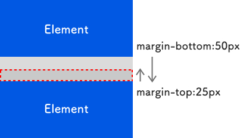

これを*折りたたみマージン*と言います。ちなみに横方向では相殺されません。

さらに詳しく知りたい方はこちらをお読みください。

<a class="article-link" href="/blogs/entry335/">
<section><div class="article-link__img"></div><div class="article-link__main">
<div class="article-link__main__title">CSSの変な仕様あるあるを力一杯列挙してみた</div>
<p class="description">CSSってムズくないですか？マジで。多分初心者がつまづくであろう、なんでこーなるの？！をまと･･</p>
<p>
<time datetime="2020-07-07">2020.07.20</time>
</p>
</div>
</section></a>

ちなみにコロナ禍のフィリピンでは人と人との`margin`は*2メートル*とやや広めですが、誰一人守ってないです。
折りたたまれてますね。

### paddingはお洋服の体に対するサイズ。ぴったりしているか、ゆったりしているか
洋服もぴったりしていると体の線が出て恥ずかしかったり、逆にぶかぶかすぎたら不格好だったりしますよね？

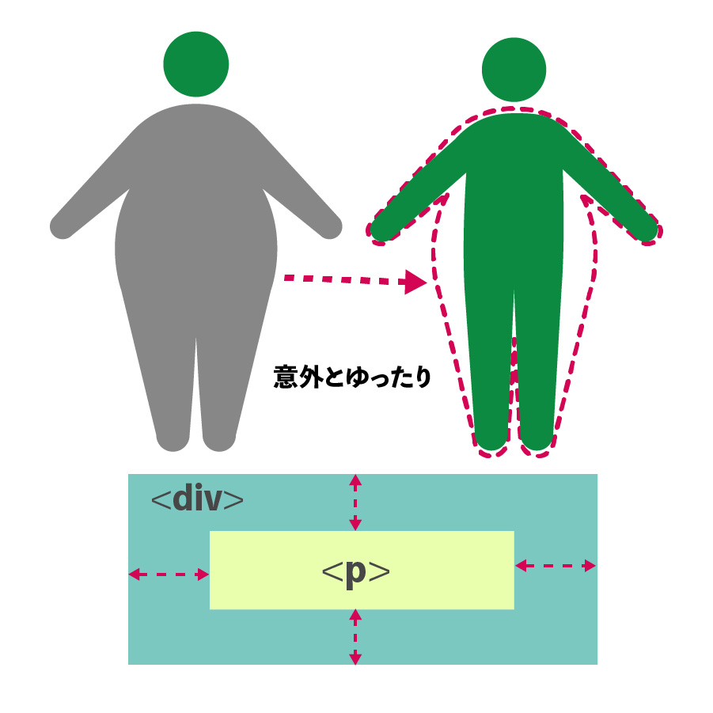

HTMLでは`padding`プロパティを使って内側の余白を調整します。

要素のサイズや内包するコンテンツによって調整します。

### おまけ・borderは洋服の厚みなど
季節に応じて、洋服の素材や厚みを変えますよね？

HTML要素ではこれが`border`や`background`に当たります。

#### レスポンシブ世代のコーディングはpaddingもborderも内側に含めましょう！
現在、コーディングはレスポンシブが主流です。

`padding`も`border`も何も設定しなければ外側に設定されます。

それを防ぐために必ず`box-sizing`プロパティを使って内側へ含めるようにしておきましょう。

```css
box-sizing: border-box;
```
## 本題・論理プロパティとは？

*論理プロパティ*とは使用する言語の種類（英語・アラビア語・日本語など）に関係なく、最小限のスタイルの変更で、Webサイトを制御できます。

今までの`margin`や`padding`は*物理プロパティ*といって要素がどう並ぼうが上下左右に値を設定できました。

```HTML
<div></div>
```

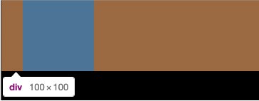

```css
div {
  background: #333;
  width: 100px;
  height: 100px;
  margin-left: 30px;
}
```
左など余白をセットしたい場所を指定したら位置が変わることはありません。

### margin-blockを使ってみる
*理論プロパティ*でmarginを設定すると要素の書字方向やテキストの向きに応じて物理的な余白に変換されます。

プロパティ`margin-block`を使ってみます。余白は要素の先頭と末尾というイメージで設定できます。

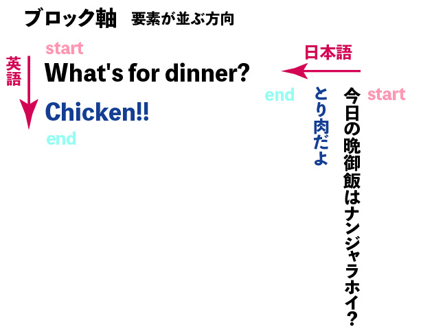

上図の通り、文字方向が英語と同じ場合は通常通り上が先頭、下が末尾になります。日本語と同じ場合は右が先頭で左が末尾です。

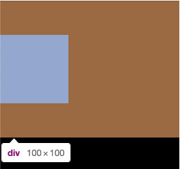

```css
div {
  background: #333;
  width: 100px;
  height: 100px;
  margin-block: 50px 50px;
}
```

ショートハンドで記述する際の順番です。
```
margin-block: 先頭 末尾;
```

上から下へ並びます。なので*余白は要素の上と下にセット*されます。<br>

最初は`margin-block-start`、最後は`margin-block-end`と分けて記述することもできます。
```css
margin-block-start: 50px;
margin-block-end: 50px;
```

<br>

* 内側の余白を設定したいときは`padding-block`プロパティを使えます。使い方は`margin-block`と一緒です。
* 上下に余白が発生し、隣接したときは折りたたみマージンが発生します。

### margin-inlineを使ってみる
プロパティ`margin-inline`で論理的なインライン方向の先頭と末尾のマージンを設定できます。

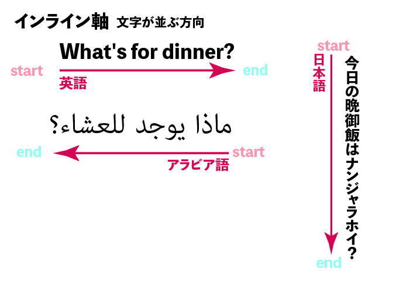

```css
div {
  background: #333;
  width: 100px;
  height: 100px;
  margin-inline: 50px 30px;
}
```
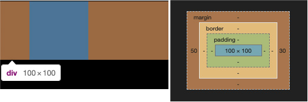

<br>

* 内側の余白を設定したいときは`padding-inline`プロパティを使えます。使い方は`margin-inline`と一緒です。

### margin-inlineとmargin-blockを使って四方のマージンを設定する
通常のプロパティ`margin`同様前後左右余白を設定するときのコードを紹介します。

今までの物理プロパティで書くコードとも比較してみましょう。

```HTML
<div class="old">
  <div>Old technique</div>
</div>
<div class="new">
  <div>New technique</div>
</div>
```

CSSはコードが長くなりますね。

```css
.old div, .new div {
  background: #ccc;
  width: 500px;
  height: 100px;
}

.old div {
  margin: 30px 100px;
}

.new div {
  margin-block: 30px;
  margin-inline: 100px;
}
```

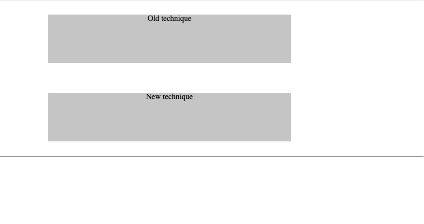

#### 文字方向を変えてみる
では、`writing-mode`を使って文字方向を変えてみます。
日本語のように文字の方向を右から左にします。

```css
.new div {
  writing-mode: vertical-rl;
  margin-block: 30px;
  margin-inline: 100px;
}
```
文字の向き（縦書き横書き等）に左右されるので余白の位置が左右・上下変わります。

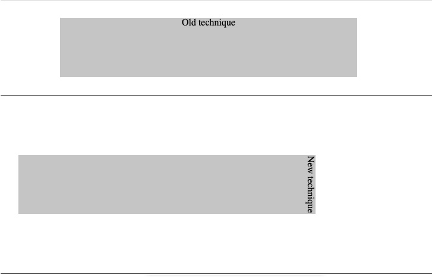

## 日本といえば美しい縦書きを実装したい！論理プロパティの使いどころを考えてみた
最近縦書きの実装が増えているので、縦書きでの実装を試してみました。

縦書きでコンテンツをセンタリングする際ブラウザFirefoxでバグがあります（IEはもうバグ対応にすら入れてません）。

ちなみに「margin-block使ったらイケるかなー」と淡い期待を持ってやってみたのですがダメでした。


```HTML
<div class="vertical">
  <p>「銀ねこアトリエ」へようこそ。
  セブ島に住むフロントエンドエンジニア・かみーゆの気ままな日記です。<br>
  フロント技術を中心とした「ウェブ制作に関するチップス」、「磨耗しない人生の選択」や「海外生活」のライフスタイルについても発信しています。<br>
  ぜひ、「銀ねこアトリエ」を楽しんでください！</p>
</div>
```

ちなみにSafariの場合、ショートハンドが使えないのでコードが長くなります。。。

```css
body {
  background: url(https://ginneko-atelier.com/static/f06cabea092b70c1fc4d476ab9c36647/14b42/bg-main.jpg) center / cover;
}

.vertical {
  padding-top: 50px;
  padding-bottom: 50px;
  width: 100%;
}

.vertical p {
  writing-mode: vertical-rl;
  margin-block-start: auto;
  margin-block-end: auto;
  margin-inline: 15px;
  line-height: 1.8;
  background: rgba(255,255,255, .7);
  padding-block-end: 30px;
  padding-block-start: 30px;
  padding-inline-start: 15px;
  padding-inline-end: 15px;
  border-radius: 10px;
  box-shadow: 0 0 15px rgba(0, 0, 0, .2);
}
```

[縦書きサンプル | CodePen](https://codepen.io/lscamille/pen/QWGLggz)

実務レベルとして使うためには、まだまだかなーという印象でした。

ちなみに[caiuse](https://caniuse.com/?search=margin-block)での実装状況です。

ChromeとFirefox以外ショートハンドはまだ実装されていません。

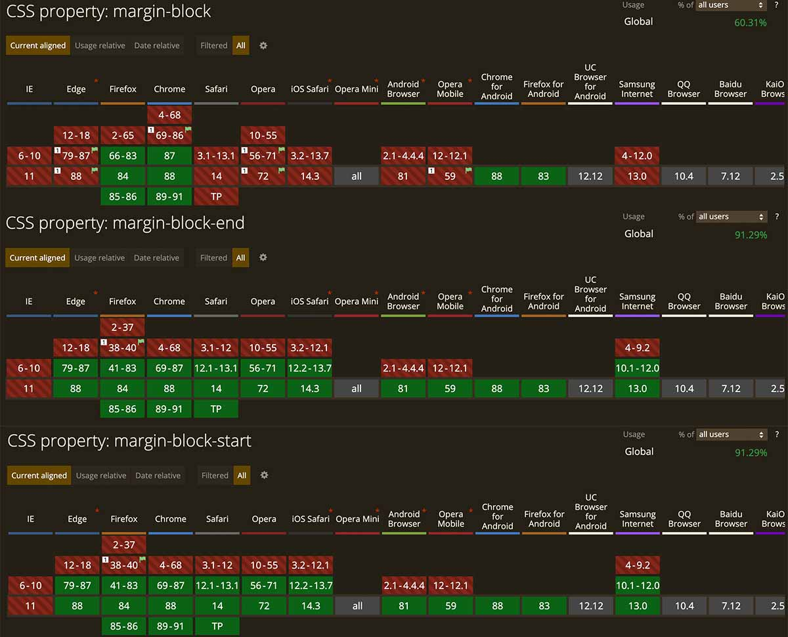

補足しておくと値は以下のように値は指定できます。

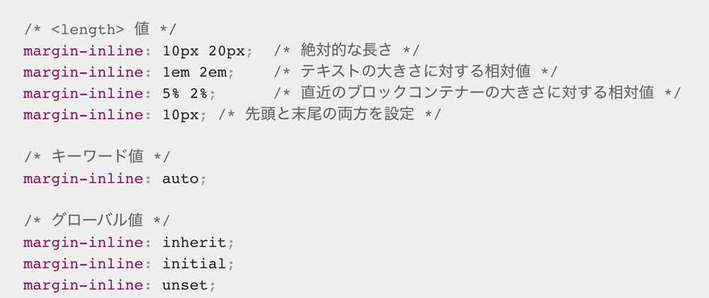


### おまけ・Firefoxで縦書きを実装
Firefoxで縦書きコンテンツの入った要素をセンタリングするためには、以下のコードで実装しましょう。

```css
  height: 任意のサイズ;
  margin-block-start: 50%;
  transform: translateX(-50%);
```

もしくは通常の物理プロパティで書くと


```css
  height: 任意のサイズ;
  margin-left: 50%;
  transform: translateX(-50%);
```
## まとめ・多言語サイトでは役に立ちそう！
前から気になっていたので今回は理論プロパティ・`margi-block`と`margin-inline`について掘り下げてみました。

まだまだ日本語での資料が少なかったのでとりあえず検証はしてみました。

結論多言語サイトで使えそうだけどまだまだ先かなーってイメージでした。

最後までお読みいただきありがとうございました。

### 参考
おなじみMDNお合わせて読むと理解が深まると思います。

* [margin-block | CSS | MDN](https://developer.mozilla.org/ja/docs/Web/CSS/margin-block)
* [margin-inline | CSS | MDN](https://developer.mozilla.org/ja/docs/Web/CSS/margin-inline)
* [padding-block | CSS | MDN](https://developer.mozilla.org/ja/docs/Web/CSS/padding-block)
* [padding-inline | CSS | MDN](https://developer.mozilla.org/ja/docs/Web/CSS/padding-inline)

さらに掘り下げて知りたい方はcolisさんのサイトをご覧ください。

[CSS知っておくと便利な論理プロパティ、ボックスモデルにおける古い方法とこれからの方法](https://coliss.com/articles/build-websites/operation/css/new-css-logical-properties.HTML)
