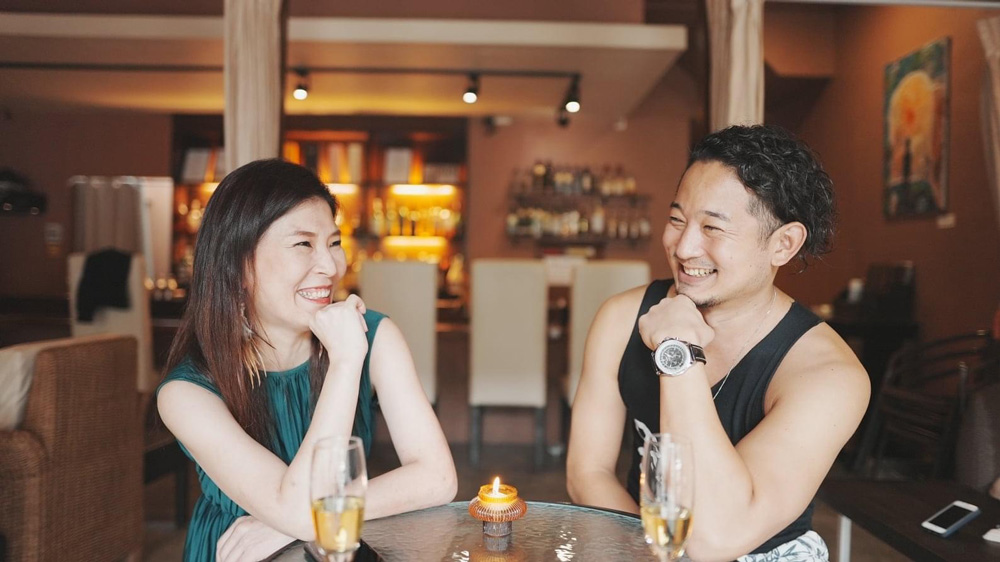
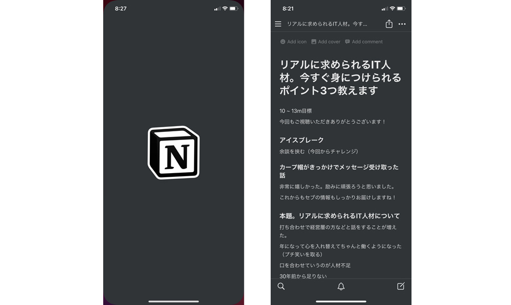
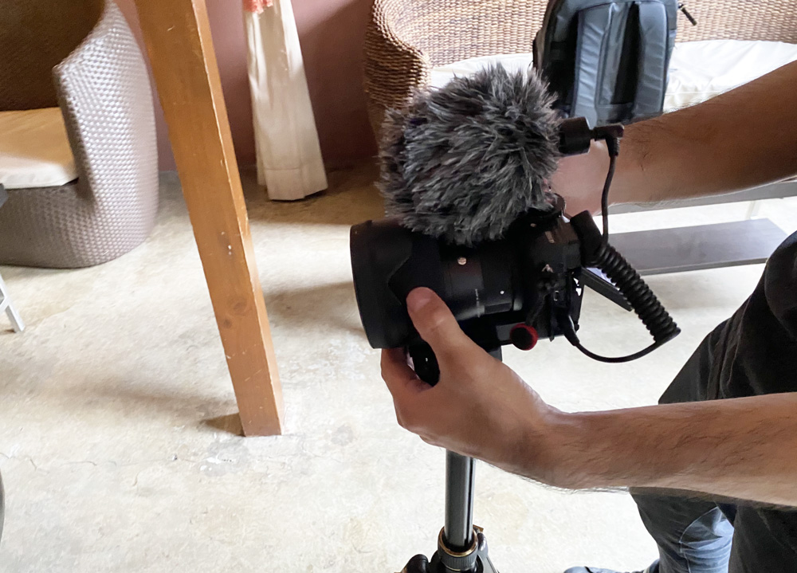
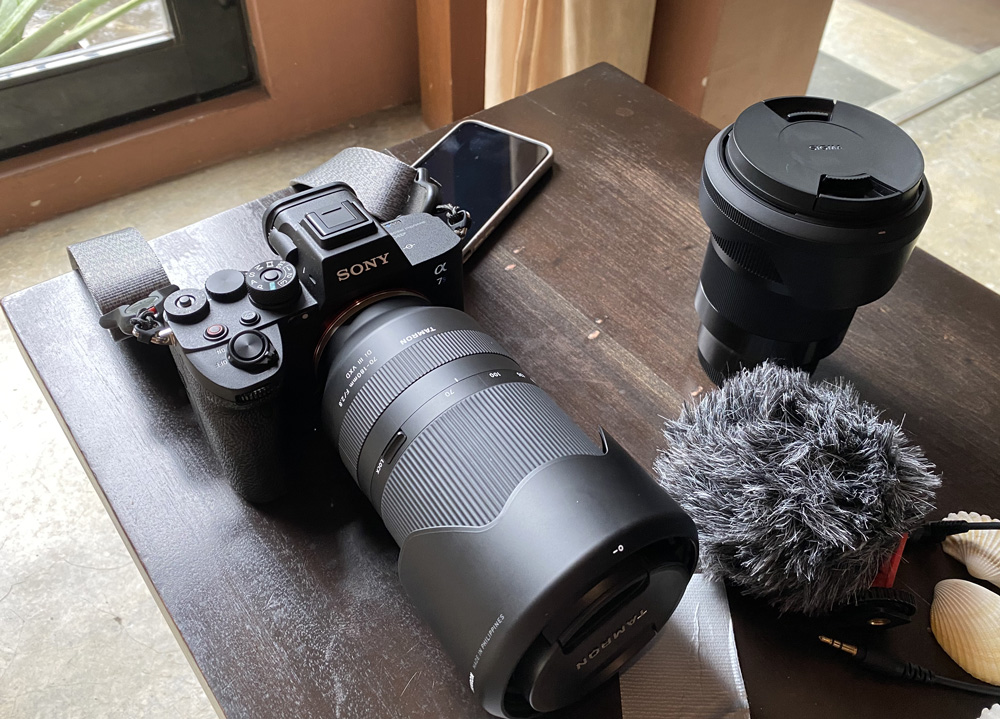
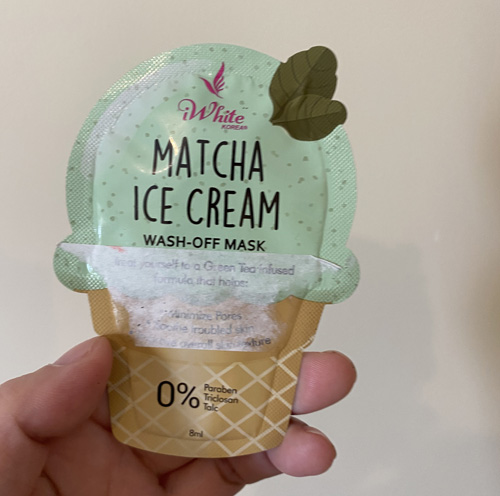

## 私がYouTubeをはじめた経緯
2020年12月、セブ島のことや仕事を発信するために「かみーゆちゃんねる」を立ち上げることを決意しました。

<a class="article-link" href="/blogs/entry415/">
<section>

2021年セブ島にオフショア会社設立。かみーゆ、YouTubeはじめました

来年2021年仲間と一緒にこのフィリピン・セブ島で「オフショア会社」を立ち上げることになりました。･･･

<time datetime="2020-12-13">2020.12.13</time>

</section>
</a>

主に仕事のこと、セブのこと、私のことを発信しているんですが「かみーゆちゃんねる」のコンセプトは「**私がやりたいことをやる**」です。

実は最初、かなり躊躇しました。

顔もすべてさらけ出すしアンチもバッシングもぶっちゃけ怖いですもん。

## 反響は想像以上にポジティブだった

<small>※ <a href="https://www.instagram.com/fred_keisuke/" target="_blank" rel="noopener">Fred</a>とRippleでの撮影の様子。</small>

想像以上に知人や知らない人から激励のメッセージを受け取りました。

 とても励みになりました。

 私の動画が知らない間、いろんな人に影響を与えているんだって感動しました。

実際会った人にも「YouTube見ました」「番組登録しますねー」って言われる様になりました。

<small>※ ちなみに私は週2、3日ぐらいしか人と会いません。</small>

 今は開き直って、少しでも良いコンテンツを皆さんに届けられる様、ビジネスパートナーと相談しながら動画作成しています。

## 私たちのYouTubeの作り方

最近、日本の知り合いから動画をどうやって作っているのか聞かれました。

せっかくなので、ざっくり我々のYouTube動画の作り方をご紹介します。

<small>※ 現時点です。日々改良しています。</small>

### 原稿作成
主に私の担当です。紙に書き出したり、もともと書いていたブログのコンテンツをそのまま流用することが多いです。

内容はできるだけ箇条書きやキーワードのみにとどめます。理由は間違いなく棒読みになるからです。

[Notion](https://www.notion.so/)というアプリにまとめておきます。

原稿ができたら、ビジネスパートナーにチェックしてもらい問題なければ撮影に臨みます。

### 撮影
動画はセブ内のカフェなどを利用して撮影しています。セブ市内のITパークやビジネスパークはキレイなんですが私有地のため野外での撮影許可が下りません。なのでカフェが多いです。

撮影はビジネスパートナーが行ないます。

原稿をあらかじめNotionでシェアし、撮影時には演者（私）、撮影する人がちゃんと流れに沿っているか確認しながら進めていきます。

最近はAロール、Bロール（カメラの視点切り替え）を入れ、視聴者に飽きがこない工夫もしています（私がやってるわけじゃないけど）。

### 動画編集（されるのを待つ）
動画が編集されるのを待ちます。動画編集のツールはFINAL CUTだったかな？

ノイズを抑えて、カラーグレーディングとかなんだり（何しているのかはあまりわかっていない。。。）して13分、長くても17、18分以内に納めます。

動画をチェックして問題なければ次の行程へ。

### タイトル・説明・字幕をつけて公開

**できるだけテロップ無し**というこだわりで作っています。

耳が不自由な人のために字幕を必ず入れています。

なかなか骨の折れる作業ですが、「*コンテンツはすべての人のために*」というマイポリシーなのでめげずに入れています。

最後はビジネスパートナーがサムネをつけて公開します。

## YouTubeをはじめて、今さら見た目を気遣う様になった

今さらですがYouTubeをはじめて自分のビジュアルを気遣う様になりました。

私が視聴者であれば清潔感はもちろん、男女問わず少しでもキレイな人の方がいいなーって思いますもん。

あくまで*視聴者に対して不快感を与えたくないなー*って気持ち、最低限の配慮です。

### 運動をはじめた

フィリピン・ロックダウンで残念ながら筋肉が落ち、贅肉がついてしまったのでいい機会と開き直り、筋トレとウォーキングを始めました。

運動してないことを怒られたのもありますが、見た目向上にもなると思ってます。

程よい筋肉のついた体は機能的。機能的なものは美しいですからね。筋トレは大事です。

ウォーキング中は次どんなこと話そうかなーとか考えたり、撮影時のイメトレをしています。

 そのうち*トライシクルとかけっこで競争する動画をとるかもしれない*ので、体力だけはつけておこうと思いますww

健康にもいいので思わぬ副産物です。

### 撮影前にマッサージ、パックやスキンケアをする様になった
化粧のりが気になるので撮影する朝にマッサージしてパックをする様になりました。

私はこの業界に入る前はもともと美容業界にいたので知識だけは豊富です。

リンパを流してスッキリするだけで小顔になるし、お肌に十分水分があるとメイクも崩れないです。

ちなみに具体的にどんなマッサージをしているかというと、スタジオメイクをしていた[田中宥久子さんの造顔マッサージ](https://www.youtube.com/watch?v=Hpq-Rf803G8)です。

撮影前のタレントや俳優さんに施していたメイクさんの考案したマッサージなので実用的で、実際小顔になります。

<small>※ 2013年に田中宥久子さんはすでに亡くなっています。</small>

### スタイリスト時代の撮影用のメイクを施す様になった
最終的にはチート（ズル）です。メイクでどうにかしますwww

<a class="article-link" href="/blogs/entry391/">
<section>

どんな女子でもメイクで4割増になる方法

フロントエンドエンジニア、今はプータローのかみーゆです。私実は元ネイリストでメイクさんで、ブライダルや地元のテレビ局なん･･･

<time datetime="2020-11-07">2020.11.07</time>

</section>
</a>

元スタジオやブライダルのメイクさんだし、光を味方につけるのは得意です。

とはいえ、不自然なモノは嫌い。ハイライトとローライトを使って立体的に見えるメイクをするだけにとどめます。

私たちが届けたいのはあくまでコンテンツ。私の見た目は不快にならない様に装飾するくらいの気持ちでメイクしています。

## YouTubeを通じて自分に対しての考え方も変わった

YouTubeを見てもらうためには単に腹を抱えて笑えて楽しめるとか、メイクのコツがわかって上手くなれるとか、**視聴者に何かしらの価値を提供できること**がポイントですよね。

YouTubeをやっているうちに、普段誰かと話をするとき、過ごすときでも*相手に価値を提供できているのだろうか*って思うようになりました。

私自身がコンテンツだとしたら、どうなんだろうって。

どういう会話が適切か。押し付けの会話をしていないか。そんなことも考えながら話をしています。  

ただ他人の目を気にしろって言っているわけではありません。

他人の目をいつも気にしていたらストレス溜まっちゃいますからね。

そもそも私が*私というコンテンツを一番見ている*ので、自分が心地よい状態の自分でいることが一番大切だとは思います。

## 今後のこと・私だから発信できること
自分って経歴だけで見ても、とても変わった人なんですよね。

30代でバツイチ・子持ち・職業訓練校を経て、フロントエンドエンジニアになったこと。

フリーランスで修羅場をくぐったおかげで技術的に信用される様になり、再就職では技術責任者。さらにヘッドハントされて海外でエンジニア講師・ブリッジSEに。

こんな女性（しかもバツイチ・子持ち）エンジニアの経験って結構稀（まれ）だと思うんです。

私だから、私のやってきたことや経験をもっと発信できたらと思います！

バツイチ・子持ちだからって正社員にもなれず安月給で使われている女性も多いと思うので、勇気や励みになればいいなあって。

弱い立場の人が都合よく権力ある人間から搾取される世の中がなくなればいいなあって心の底から願います。

## まとめ・今後とも「かみーゆちゃんねる」をよろしくお願いします
これからYouTubeをはじめたい人へ伝えたいことです。

結論・YouTubeを始めて本当に良かったと思います。  

* 想像以上に他人へ勇気や希望を与えた
* 自分の健康や美容を見直すことができた
* 誰かに価値を与えるために何ができるかを考える様になった

 YouTubeって何かを発信するツールじゃないですか。

「誰」に「何」を伝えたいか、めちゃめちゃ考えます。

大切なことって**「誰に何を伝えたいか」がブレないこと**じゃないかなって。

その「誰」かが「ファン」になるから、芯を持っておくことが大切なんじゃないかと思います。

一人のアンチにびくびくするより一人のファンのありがたさを感じていればきっとアンチなんて気にならなくなると信じています。

 まだまだ新米YouTuberではありますが、興味がある方はぜひ「かみーゆちゃんねる」の登録をお願いします。

[かみーゆちゃんねる](https://www.youtube.com/channel/UCbSgjkCIPucux8cFTuQcdcw)

この記事が、今後YouTubeを始めようと思っている方の一助となれば幸いです。

私もはじめたばかりですがぜひ一緒に頑張りましょう！

最後までお読みいただきありがとうございました。
