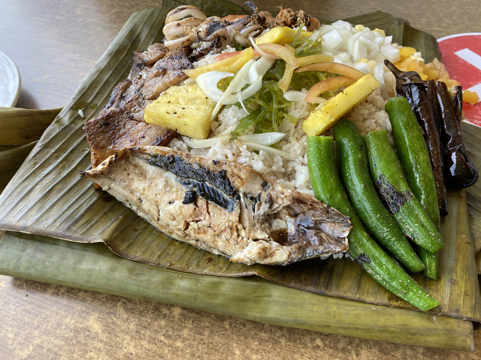
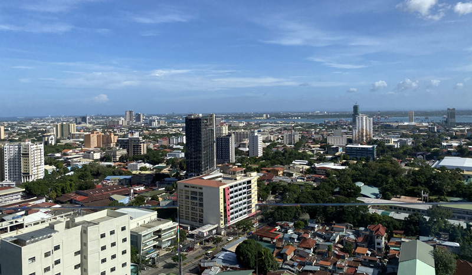
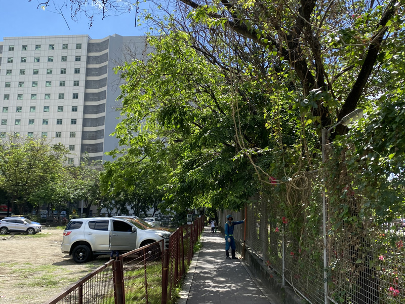
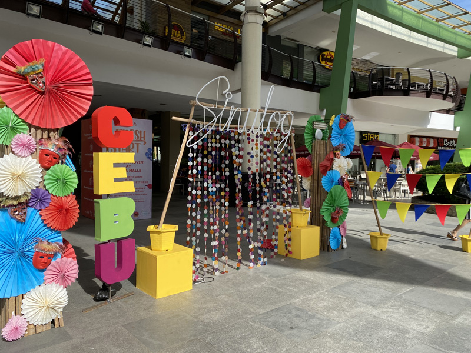
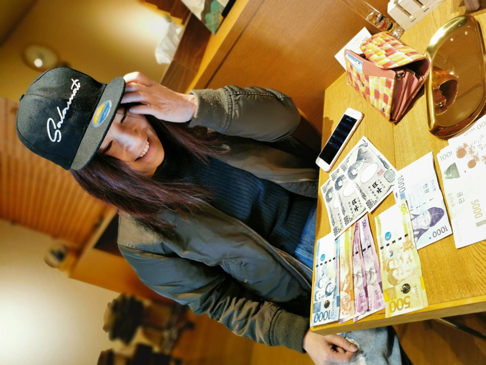

## 久々にきちんと働いてみて、、仕事は楽しい

昨年9月にセブ島の日系企業を退職し、そのままサブに残り充電生活を送っていました。

3か月と決めていたので、今年に入り本格的に仕事を再開しました。

YouTubeの反響もあり、いろんな人からお声がけいただき、感謝の限りです。

さて、本題です。 
久々、マジメに働きはじめたのですが、自分と自分のビジネスパートナーのペースに合わせてのんびりしていて*ぶっちゃけ働いている気はしない*です。

前みたいな焦燥感というか、何かに追われてる感じはまったくなくなりました。

おうちに居ることが飽きたらカフェへ行ったり、友達とランチしたかったら朝早くから仕事したり。

<small>仕事を早めに終わらせて、アヤラモールで友だちとランチ。</small>

 のんびりゆったり自分の仕事に向き合い、コードを書く。そんな日々を送ってます。  

実は一時期コードを書くのがトラウマになっていましたが、改めて書くと楽しいですね。

仕事を楽しむためには心の余裕とメンタルが安定してないと難しいですね。  

仕事は本来楽しくてステキなこと。そんなことにも気づけます。  

自分の思うように実装できた時の爽快感、お客さんにデモを見せたら想像以上の出来でテンション上がるって言われたり、そしてこれがお金という対価になる。

とても充実してるなぁって実感します。

## 「働く」ということを深く考えた半年

この半年間、「働く」ということを真剣に考えました。

仕事に対して真剣に考えてた方だと思ってたんですが、振り返ると「**結果磨耗した**」ことが多かったです。

いつも全力投球だったんですよね。1日8時間をひたすらすり減る。

8時間苦しい毎日なんて苦行・荒業でしかないですから。  

今後はもっと幸せになることへフォーカスし、幸せになるため「仕事」をするつもりです。

## 毎日が幸せだなーって思いながら働くにはどうすればいいか？

「幸せ」って、結構**意味が漠然としてる**と思うんです。

人によってそれぞれ「幸せ」が違います。  

なので私にとってどんなことが「幸せ」なのか考えてみました。  

楽しいとか、気持ちが高揚したり、充実してるなぁって感じる時間をたくさん過ごしている時。

そんな気持ちの時が私にとっての幸せと感じます。  

ではどんな時、そんな気持ちになるか？

私が仕事中幸せだなーって感じる瞬間はどんなときなんだろう？

### 自分が納得いくパフォーマンスを発揮したとき

単純にいい仕事した時は自己肯定感が生まれますよね。精神的にも満足します。

たとえば、私はエンジニアなので難しい実装を手早く実装できた時最高に気分がいいです！

毎日いい仕事したなあって思うためにはのほほんとしておけないんですよね。

必要なのは日々の勉強です。日々キャッチアップを怠らない。この一言に尽きます。

### 仲間と楽しい時間を過ごせてるとき

私の人生で*どんな人と働くかがもっとも重要*です。

理由は2つ。

* 単純に人が好き
* 私のパフォーマンスって人に左右される

実際にこれまでも何度も仕事仲間の発言や行動で心を揺さぶられ、異常なまでのパフォーマンスを発揮することができました。

具体的には1日でLP（ペライチのサイト）作っちゃったりとか。

私は*この人のために頑張りたい*って思うと結構難易度高いハードルも越えることができます。

もともと私、人が大好きなんですよね。

仲間のために頑張り、成果も出せたらそれ以上の幸せはないです。

### 自分のビジネス・信念に情熱を持ったお客さんといるとき

私は自分のビジネスやサービスに情熱を持っている人って話をしたら熱が伝播するんですよ。

そんな人に対しては寄り添って、一生懸命仕事をしたくなるものです。

さらに感謝された日には極上の幸せを感じてしまいます。

さらにさらにいい仕事したくなります。

## どんな人と働きたいかに重きをおく

私にとって*仕事をする上で重要なのは人*です。なので人を選びます。

私の一緒に働きたい人（クライアントや仲間）を選ぶポイントは心から**尊敬・信用**できるか、です。

下手したら結婚相手よりも真剣に選んでるかもしれません。

### 尊敬できる人：どんな信念や考え方を持っているか

尊敬できるかどうかはどんな「信念や考え方」を持っているかをよく観察するようにしています。私と考えが違っても構いません。違っていても感動したり感心することもあります。

一緒にいると考え方にも少なからず影響を受けます。だからこそどんな信念や考えを持っているかが大切なんです。

### 信じることができる人：行動がすべて

私はわりと、人の言っていることは話半分に聞くタイプです。

理由は「口ではなんとでも言える」からです。

いつも*何をしているか*を見てます。

行動がすべてを教えてくれます。

逆に、言葉にしなくても行動からその人の誠実さが伝わってくることもありますしね。

## リターンはお金だけじゃない

仕事の対価ってお金だけじゃないんですよね。

お金って報酬は分かりやすいですが、一緒にいると励まされ成長できたり、仲間の喜ぶ顔が見れるのも幸せだったり、新たにステキな人と出会えたり。巡り巡って仕事紹介してもらったりなんかもあります。

誰とどんな仕事をするかを変えるだけで、お金には変えがたい対価が生まれることもあるんですよ。

その対価こそが「幸せ」だと思っています。

トータルでどんな対価が得られるかは自分次第です。

## まとめ・仕事は幸せを実現する手段

以前付き合ってきた人が言ってました。

「残り10年したら早期リタイアする。それまで耐える。」

私はその人の気持ちがちっとも理解できませんでした。  

**我慢したその先に幸せって保証されてるんでしょうか？**

今幸せじゃなくてどうするんでしょうか？  

1日の8時間がつまらないなんて不幸でしかないと思うんです。

組織にどうしても馴染めないなら個人で働くこともできる時代です。

だから、誰とどこでどんな仕事をするかを真剣に考えて選択する。今後は誰でもそんな生き方ができるんじゃないかと思います。

この記事がこの先のキャリアを考えるあなたの一助となれば幸いです。

最後までお読みいただきありがとうございました。
