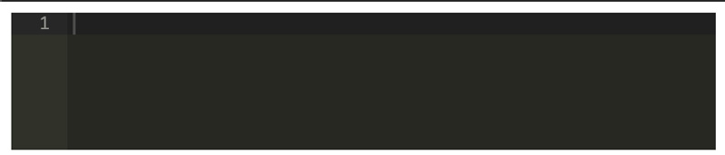
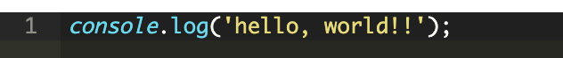

## Aceエディターとは？
今回お仕事で出会った、JS製埋め込み式エディターの使い方をご紹介します。

> Ace is an embeddable code editor written in JavaScript.<br>
> AceはJSで書かれた埋め込み可能なエディター。

https://ace.c9.io/

コードを紹介するためのエディターというよりはむしろ、コードを書くためのエディターを埋め込めるライブラリです。

### 特徴
めっちゃ高機能です。主には以下のような特徴があります。

* 110以上の言語をサポート
* 20以上のテーマ
* 膨大な行でも大丈夫（100万行以下）
* 正規表現で置換や検索が使える
* リアルタイムでチェック可能 (現在JavaScript/CoffeeScript/CSS/XQuery)

## Aceエディター基本の使い方
では、実際に実装してみましょう！
リファレンスを参考にしつつ、CDNに上がっているライブラリを使ってみます。

* 言語・JS
* ID「editor」のタグにセット
* テーマ「monokai」とつかう

```html
<div id="editor" style="min-height: 100px"></div>
<script src="https://cdnjs.cloudflare.com/ajax/libs/ace/1.2.0/ace.js"></script>
<script>
  const editor = ace.edit("editor");
  editor.setTheme("ace/theme/monokai");
  editor.session.setMode("ace/mode/javascript");
</script>
```

コードはシンプルに7行。

style属性にテキストエディターの最低の高さを付与するため、min-heightをセット。

カンタンに実装できました！！



実際にテキスト（JS）を打ち込んでみるときちんとハイライトがリアルタイムで効きます。

  

### いくつかの実装方法をご紹介

ID「editor」にセットした場合の説明です。

まとめてオプションを渡すこともできます。
```js
const editor = ace.edit("editor", {
  selectionStyle: "text"
});
```
オプションを取ってくるパターン
```js
const editor = ace.edit("editor", {
  selectionStyle: "text"
});
```

オプションだけ渡すパターン

```js
const editor = ace.edit("editor");
editor.getOption("optionName");
```

テーマを確認したいときはこちらをご覧ください。

https://ace.c9.io/build/kitchen-sink.html

## コードの内容を他のフォームに移動
今回やったのが任意のフォームパーツ・テキストエリアへAceエディターに入力された内容を移送するというものでした。

textareaにはhtmlコードを記載したかったので、どうしてもAceエディターが使いたかったです。

<br>Aceエディターに変更があったらテキストエリアの内容も変更できるようにしました。

### HTMLの紹介
```html
<div id="editor" style="min-height: 100px"></div>
<texstarea name="message" style="display:none"></texarea>
```
### JSコードの紹介
```js
var textarea = $('textarea[name="message"]');
editor.getSession().setValue(textarea.val());
editor.getSession().on('change', function(){
  textarea.val(editor.getSession().getValue());
});
```

これでコードを書き換えるたび、コードが任意の`textarea`タグに転記されていい感じになりました！

## トグルボタンでテキストエリアのサイズ変更
次にやりたかったのが、コードを各エリアのサイズ変更です。

AceエディターはJSを読み込んだ時に、サイズを取得します。なのでエリアのサイズ変更する場合は再読み込みしなければなりません。

なので`const editor = ace.edit("editor");`などで作成したAceエディターを一度削除する必要があります。

```html
<div id="editor" style="height:200px;"></div>
<textarea name="message"></textarea>
<input type="hidden" name="html_area_row" value="<!--{$text_row}-->" />
<button id="resize-btn">入力欄を拡大する</button>
```

JSコードです。

`destroy()`で作ったAceエディターの設定を削除し、htmlのコードも削除します。

jQuery使用前提で書いてるのでご注意を。

```JS
// 初期化するコード
function aceinit(){
  var editor = ace.edit("editor");
  editor.setFontSize(14);
  editor.getSession().setMode("ace/mode/html");
  editor.getSession().setUseWrapMode(true);
  editor.getSession().setTabSize(2);

  var textarea = $('textarea[name="bloc_html"]');
  editor.getSession().setValue(textarea.val());
  editor.getSession().on('change', function(){
    textarea.val(editor.getSession().getValue());
  });
}

//初期化
aceinit();

$('#resize-btn').on('click', function(){
  // #editorの設定したを削除
  ace.edit("editor").destroy();
  //htmlも削除
  $('#editor').html('');

  //高さでサイズ変更
  if($('#editor').height() < 300) {
    $('#editor').height('600');
    $(this).text('入力欄を縮小する')
    aceinit();
  } else {
    $('#editor').height('200');
    $(this).text('入力欄を拡大する')
    aceinit();
  }
})
```

## まとめ
おそらく、CMSに組み込むようなマニアックな実装をする人は数少ないと思いますがお役に立てれば幸いです。

最後までお読みいただきありがとうございました。
