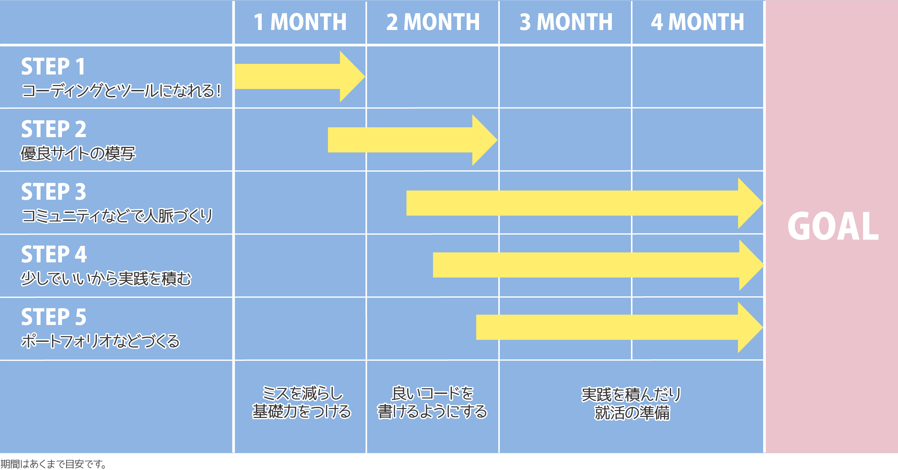

## ロードマップは6つ目の壁の考えを取り入れつつ作成しました

私がエンジニア講師の時によく紹介していた、6つの壁についてご紹介します。この考えをもとにロードマップを作りました。

初学者はまず「知らない」の状態からスタートします。独学、スクール、なんの媒体で勉強するにせよみな一緒です。

ご覧の通り、知識の壁を超えた後のほうが長いです。リスタートであれば、すでに就職している人に比べてスタート時点で「気づき」や「技術」でハンデがあります。

なので通常の学習とは別にできるだけ多くの壁を越えておきます。

## 実際のロードマップをご紹介

私の提案するロードマップをご紹介します。

1. コーディングとツールになれる
2. 優良サイトの模写
3. コミュニティなどで人脈づくり
4. 少しでいいから実践を積む
5. ポートフォリオづくり

最初の1か月はとにもかくも基礎力をつけます。スキルを習得しやすい状態を作ることが大事です。

ステップごとに細かく紹介します。

<small>スクールに通うことやオンライン教材、そちらとは別メニューと考えてください。</small>

### STEP1. 最初の1か月は脳死状態でいいからとにかく写経し続けろ

最初の頃は慣れないローマ字でのタイピングでミスタイプが連発します。HTMLのレイアウトは崩れる、JSではエラーでいつもコンソールが赤い。理由がわからずこの世の終わりのように悩む。あとあと見てみると大したミスじゃないじゃん！？  

**自己嫌悪**に陥りますよね？  

仕方ないんです。どんなにタイピングが得意でも日本人だとR・Lの綴り間違いなどしょうもないミス大連発です。

それが普通。自己嫌悪に陥る必要ありません。だって慣れないことやってるんですから。落ち込むだけ感情のムダです。  

初学者で毎回ミスを悩んでる人は「*なんで私こんなしょうもないミスしたんだろう*」っていう感情を捨ててください。  

最初の1か月はとにかく頭で考えるより、体に叩き込んでください。

書いているうちに体が慣れます。プログラマーやコーダー目指す方は、**タイピングスキルとツールの使い方だけは可能な限り「習慣の壁」まで到達**してください。

何も考えなくてもできる状態です。 

ちなみに私は教材3回やりました。教材にあったHTMLとCSSのタグは大抵覚えることができました。

そして大事なのはツールを使いこなすことで主にはショートカットを覚えること。

頭で考えなくてもコードが書けるレベルになるまでやりましょう。

### STEP2. 力のないうちのオリジナル作品なんて黒歴史！良質なサイトを模写して学べ

この段階ではまだ好きにコーディングするのではなく、**Webサイトを模写することをオススメ**します。

先に言っておきますが*模写ってあまり面白くない*です。でも確実に力がつくのでやったほうがいいです。  

昔の私はこの時点で調子に乗って模写をすっ飛ばし、*オリジナリティー溢れるクソダサいポートフォリオ*を作りました。  

自分の中では精一杯作りましたが、自己満でダサいので見事に最初の面接落ちました。

企業にとってあなた基準の誠意杯なんて必要ないんです。  

*業界スタンダードな能力を持った人材が欲しい*んです。  

Web上には業界スタンダード以上の教材がゴロゴロ転がっています。そんな素晴らしいサイトのコーディングの仕方を真似しなくてどうするんですか？  

とはいえ、慣れないうちは1サイトをまるっとコーディングするのは大変です。

最初から1サイト丸っと模写したら、そこで心が折れます。

なので見出しとかボタンなどパーツから真似してみるのをオススメします。

この段階ではたくさんの「気づき」を得てください。

### STEP3. 業界の人脈の輪を広げろ
勉強中の頃から人脈を増やしておきましょう。この業界の人って勉強大好きなので勉強会のコミュニティに入ることをオススメします。

分からなくても自信がなくてもいいんです。先輩と仲良くなっておきましょう。

勉強中だから分からなくて当たり前とわりきりましょう。

コミュニティで顔を知っておいてもらったら、いざ困った時技術面や就職などで相談に乗ってもらえることがあります。

結果的にメンターになってくれていた、とか。  

私もやらかしたことありますが、謙虚じゃない姿勢って良くないですね。勉強中だからと言って*バカにされたくな*いとか思ってしまいますが、謙虚に学ぶ姿勢でいましょう。

そして頼りっぱなしはNGです。

将来あなたが助けてもらった分誰かにそれくらいしてあげる気持ちで臨んでください。

### STEP4. なんでもいいから案件やプロジェクトをやって経験を積め
私のかつての生徒さんたちはクラウドソーシングで安くても案件をやって実績を積んでいました。

スクール生などは*圧倒的に実務経験が足りません*。

プログラミングてt勉強しているうちも大変だと思っているでしょうが、実務でやる方がもっと大変です。

実務を積むのにクラウドソーシングがオススメです。

でも、**武者修行にはうってつけ**だと思います。  

ぶっちゃけクラウドソーシングの案件、価格は酷いもんです。たまに**プロを舐めてるのか？**って思います。  

デザインできるのであればバナー作成などもオススメです。

私も昔駆け出しの頃カラーミーの組み込みを3万円でやったことがあります。

今だから言えますが、結構ヤバイものを納品してしまいましたw  

一人での実案件が不安なら、STEP3で広げた先輩に相談して案件に混ぜてもらうなどもありです。勉強会に参加しているようなエンジニアなどであれば、自主的にサービスを開発している可能性もあります。

イメージスライダーの実装など、一部だけ担当させてもらえばいいんです。

安くてもタダでも実際の経験をやっていることが大事です。

明日の自分の価値を高めるために自分の時間を投資してください。

### STEP5. ポートフォリオには人柄をぶつけろ。絶対周りと同じテンプレで作るな
スクール生でやりがちなのは学校が用意したテンプレを使ってWebサイトを作る。

これ絶対やっちゃいけませんね。 
採用側もバカじゃありません。「似たようなのが来た。またかー」って思われちゃいます。  

知恵を絞って、オリジナルで作ってください。ポートフォリオは**可能性**や**実力**を見るもの。

ではどんなポートフォリオがオススメかというと、私の担当した30歳すぎた生徒さんのケースをお話します。  

就職したい会社の理念や傾向を徹底的に調べていました。対象の会社の考えを汲んだ上、自分の思いや熱意をメインビジュアル付近に持ってきたあと、作品を最後の方に持ってきてました。

ポートフォリオは実力だけじゃなく**可能性**も見ます。

職業訓練校やスクールのポートフォリオに載ってる作品なんて「型化」してるからみんな似たようなもの。多少他人よりもうまく作れてると自分で思っていても*プロから見ればみんな一緒*です。

私がもし採用担当者であれば「またこんなのきたー」って大して確認しませんね。  

差をつける方法はあなたという「人」を前面に出すしかありません。

「人の想い」ほど人を動かすものはありません。

採用するのも「人」。「この人と一緒に働きたいか」というのをみているはずです。

### おまけ・ 本気で就職したいなら会社見つけて自分で自分を売りこめ
さらにハードルあげます。

私の知り合いの地元Web制作会社の役員さんが言ってました。

「本気で就職したいならその会社のサイトに問い合わせしてほしい」

完全同意です。

なぜ転職エージェントにすべてを頼るのでしょうか？

え？他人まかせ？*自分の将来がかかってるんですよ？*  

企業にとって「人を雇う」って投資と一緒ですよ。

あなたの将来がその会社のためになる可能性があるから雇うんですよね？

本気でこの会社の戦力になりたいと思うんならそのくらい売り込んでいってもいいと思います。  

企業は人の可能性をみてますから。  

体当たりした結果、「即戦力じゃないからいらない」って言われることもあると思います。

そういう会社は*ぶっちゃけ人を育てる体力のない*かもです。たとえ運良く滑り込めても、忙しくてすり減って終わる可能性もあり、駆け出しさんにとって不幸になる可能性もあります。

## まとめ
私の考える4か月のロードマップのサンプルを紹介しました。

余談ですが、なんでこんな記事を書こうと思ったかというと、、、

先日Twitterで駆け出しさんのこんなTweetを見つけました（プライバシーの関係で貼りません）。

プログラマーになりたい理由です。

* ITリテラシーがつく
* Macを持って仕事できる
* 私服で過ごせる

その職種についたらなんとなくかっこいいというだけでなるのは大変危険ですよーw

それに対しての私の意見。

<blockquote class="twitter-tweet">
エンジニアという職種にキラッキラに憧れている人へ現実を申し上げます  わりとスーツ わりとWindows 忙しすぎて出会いがない 勤務時間外も勉強しないといけない 自分の範囲外のITリテラシーはさほど高くない<a href="https://twitter.com/hashtag/%E9%A7%86%E3%81%91%E5%87%BA%E3%81%97%E3%82%A8%E3%83%B3%E3%82%B8%E3%83%8B%E3%82%A2%E3%81%A8%E7%B9%8B%E3%81%8C%E3%82%8A%E3%81%9F%E3%81%84?src=hash&amp;ref_src=twsrc%5Etfw">#駆け出しエンジニアと繋がりたい</a>
&mdash; かみーゆ@セブ島呑んだくれフロントエンジニア (@LirioY) <a href="https://twitter.com/LirioY/status/1368797450064994306?ref_src=twsrc%5Etfw">March 8, 2021</a></blockquote>

ほとんどのIT業界の人はWindowsだし、IT土方（どかた）ていうくらいキツイこともあります。  

ぶっちゃけ甘い考えではエンジニアにはなれませんが、なれなくもないです。

私だけではなく今までエンジニア講師時代に見てきた生徒さんを考察して「こうしたほうがいい」を取り入れて考えたロードマップです。

人によって飛ばしていいことや、もっとやったほうがいいこともあります。

決して楽しいとは言えないし、序盤はとてもキツイです。たった数ヶ月続けて人生が変わるのであればやる価値はあるとは思います。  

そして、なった後のビジョンも持っておくといいと思います。

私は持っていなかったので、ぶっちゃけ*10年経った今も勉強し続ける*なんてその時は微塵も気づきませんでした。  

今では勉強も楽しくできるようになりましたが、なった後にどんなことが起こるかも覚悟を持ってWebクリエーターなどを目指すことをオススメします。

この記事がエンジニアなどのWebクリエーターを目指す方の一助となれば幸いです。

最後までお読みいただきありがとうございました。
