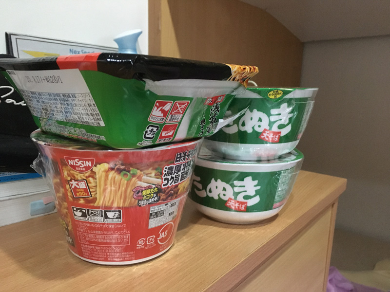
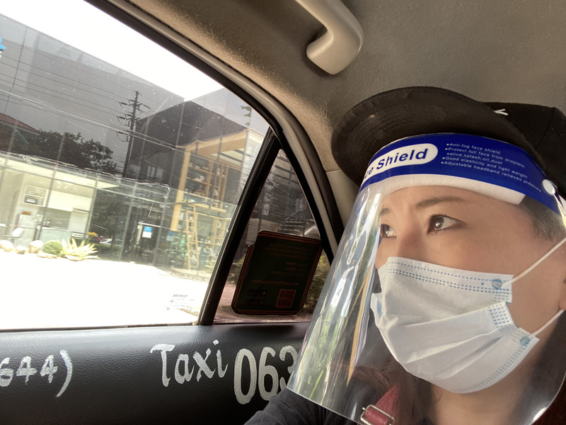
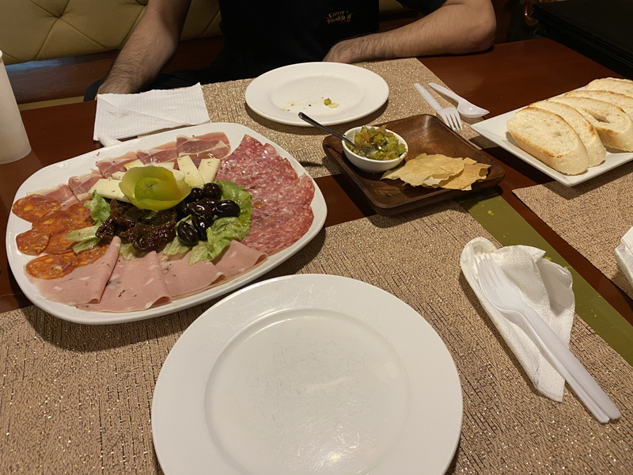
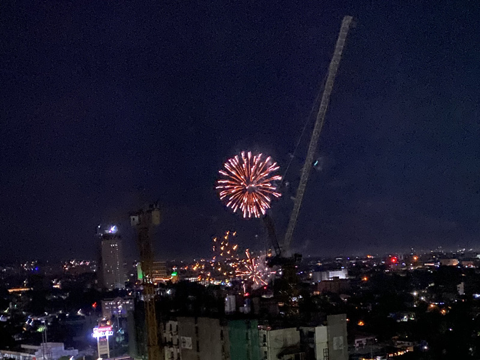

## ロックダウン、1年も続くとは想像しなかった

こちらまだまだ継続中です、ロックダウン。ロックダウンとは街などの単位で行き来を制限されることです。

セブシティロックダウン1か月を振り返る記事を書きました。去年、ロックダウンされて1か月の頃です。この頃はまだこんなに大変になるとは思ってませんでした。

<a class="article-link" href="/blogs/entry365">
<section>

セブシティロックダウン 1ヶ月を振り返る

コロナの影響でセブシティがロックダウンになりました。20時以降外出禁止、移動手段なし、あちらこちらに軍隊。多分日本では想像できない状況です。･･･

<time datetime="2020-04-25">2020.04.25</time>

</section>
</a>

この1年、この国の方針や施策には相当翻弄されました。1年前の私は能天気に海外で働けることが嬉しくて、フィリピンがどんな国か理解できてませんでした。

まずはこの1年の感想を簡略化して振り返ります。

### 経済に大打撃。ECQ（Enhanced Community Quarantine）施行
2020年3月28日正午ついにセブシティでもロックダウンが施行されました。

正式名はECQ（Enhanced Community Quarantine）。日本語にすると「強化したコミュニティー隔離措置」です。

はじめに施行されたのは確かマニラ。3月15日だったはずです。

車の往来がなくなり、あれだけ排気ガスで大気汚染がひどかったセブの空気が澄み渡りました。

制限されたのは以下。

* 基本外出禁止
* 外出時に身分証や外出許可証の携帯
* 門限

<small>※ 外出できないからカップ麺を買い貯め。</small>

取り締まりは厳しく銃を携帯した軍隊が町中にいました。外出許可証不携帯などで何人か捕まった日本人もいるそうです。

外出許可証を忘れないように気をつけました。

まだタクシーなどの交通手段は使えず、個人的な交通手段は徒歩のみでした。

どうしても用事があって、何度か40分かけて会社に歩いて行きました。かかとにたくさん靴づれができました。

*文明ってすごい！めっちゃ便利な生活をしてた*んだと改めて思いました。

### 一瞬MECQへ。瞬時にECQへ。
5月30日よりGCQ（General Community Quarantine）になりました（一般的コミュニティー隔離措置）。

この期間があったおかげで、久々に外で食事しました。前から約束していた日本に帰る元同僚と食事できました。

と言ってもテイクアウトしかまだ出来なかったのでホットドッグを買って一緒に公園で食べたくらいです。

たとえテイクアウトでも自分の足で歩いて買い物に行けるのは楽しかったです。  

15日後見事に厳しいロックダウンが復活しましたけど。

### GCQ。そしてMGCQへ。
2020年7月末やっとGCQまで緩和。9月からさらにMGCQ（Modified General Community Quarantine）になり、気楽に外食できるようになりました（変更を加えた（緩和）一般的なコミュニティ隔離措置）。

マスクとフェイスシールド着用で、タクシーも使えるようになりました。。2 ~ 3人までという乗車人数の制限もあります。  

レストランなどの公共の場所でお酒が飲めるようになりました。コップ2杯までという制約付きです。

* コップのサイズは？
* 量は？

そんなツッコミしたくなりますよねww

この頃には門限がだいぶ緩和、門限は10時までに延長されました。門限を破りたくないので**昼飲み**が増えました。

たかだか外食です。たかがか、もしれませんが、この瞬間がどれだけ幸せだったか。

人と食事をするのってどれだけ幸せかってこの時思い知りました。  

11月くらいにはいつの間にか門限が11時になり、新年とクリスマスは規制されているはずの花火がドッカンドッカン上がってました。

この頃にはチェックポイントでテントに退屈そうな人が配置されているだけになっていました。ひどい時は人すらいません。それでもロックダウンは続いていました。

### 2021年再びリカーバンへ
2021年になりました！！そろそろ開国するのではないかとワクワクしていました。

検温、住所や連絡先の明記さえすれば結構どこでも行き来できるようになりました。

そんな中2月2日セブシティ再びリカーバンになりました。幸い、セブシティでは販売禁止されてないので家飲みはできます。

## セブシティ、一年経った今
ロックダウンから1年。3月になって1日感染者5000人以上と鬼記録を叩き出しました。爆上がりです。

この1年ロックダウンにもかかわらず、ひたすら経済と治安が悪化しました。

しかもルールの追加・変更が日本では考えられないタイミング。夜中0時に発表、正午から施行とかよくありました。

突然のルール変更に振り回された一年でした。

### ルールは行き届かない。というか不可能だと思う
ロックダウン中老人子供は外出禁止ですが、スラム街では外に子どもいるし、路上にはホームレスの老人が寝転がってる。もちろんマスクもフェイスシールドもつけていない。

カーボンマーケットに行った時も、場所によってはマスクをつけている人はいませんでした。

先日なんてセブシティの山岳部でリカーバンの規則を破ってお酒を提供しているレストランが多数あり、問題になっていました。山間部であれば、政府の目は逃れやすいですからね。

明日コロナに感染するより、今日の生活の方が大事。長いロックダウンでようやく再開できた楽しみや経済活動に制限がかけられてはたまったもんじゃないのでしょう。

貧困。この国では社会の構造上、ロックダウンを行き届かせるのは厳しいでしょうね。

### 減っていく日本人。親しい人が帰っていくのは寂しい
セブ島といえばリゾートや格安英語留学です。

フィリピンは入国制限で行き来できなくなり、旅行やマリンレジャー、語学学校は大ダメージです。

その影響もあり、たくさんの日本人が帰りました。

今まで仲よかった人がたくさん帰ってしまいました。

### 失業。肌身に感じる経済悪化
リゾートや格安英語留学のビジネスをしていた会社はどんどん撤退。そこで働いていた人ももちろん職を失います。

フィリピン人は大学卒業し社会人になっても家族と住んでいます。多い家族で8人とかザラです。

安い給料でもみんなで稼げばなんとかやっていけます。

フィリピンの語学学校はたくさん閉鎖しました。もちろんたくさんの人がそのあおりを受けました。

弱い立場の人からどんどん切られていくんだなって、たくさん、たくさん悔しい思いをしました。

## さいごに・それでもこの国にいる理由
経済状況も治安も悪化。

それでも私はこの国に残る理由です。

私はフィリピンで雇用を生みたいからです。雇用を生むだけじゃダメで、彼らを独立させ自ら稼ぐ力をつけて欲しいからです。

彼らの生活を保証するのではなく、一緒に稼ぐ力を養っていくのが目標です。

そして彼らが成長して、新しく稼ぐ力を養う組織を作っていくのが私の夢です。

外資系企業や富裕層に安い給料で都合よく使われる。しかも都合よく使われることに対しても甘んじている。なんか納得できませんでした。

定職につくことが正義で、自分で稼いでやろうって人はあまり見たことがありませんでした。

自分の人生ぐらい変えてやろうって人が一人でも増えたらちょっとづつ変わってくるんじゃないかって思っています。

私も昨年退職し、3か月充電中にこちらで会社を作る決意をしたので0からのスタートです。

少し時間はかかりますが、どうぞ見守っていただければ幸いです。

最後までお読みいただきありがとうございます。
