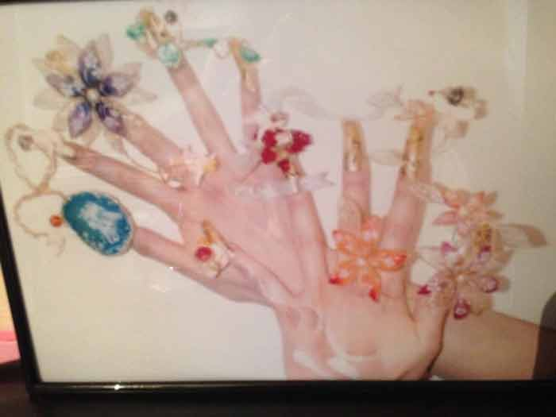

## 弱い立場であればあるほど、時間って奪われる
昨年あっちゃんの「中田敦彦のYouTube大学」でテイカー（奪う人）とギバー（与える人）について詳しく知りました。

ギバー、テイカーとマッチャーの説明をざっくり。

* *ギバー*...与えるもしくは奪われる人
* *テイカー*...奪う人
* *マッチャー*...ギブアンドテイクのマインド

[【GIVE&TAKE①】与える人こそ成功する時代](https://www.youtube.com/watch?v=qTW80vS7_BQ)

今までの人生でたくさんのテイカーとギバーを見てきたなーって納得しました。もちろん、自分もテイカーだったことはあると思っています。  

とくに奪われてしまうのが*時間*。

時間とお金は同等、ないしは時間の方が価値はあります。なので簡単に分け与えるものではないです。それを前提に読み進めてもらったらと思います。

### ネイリスト時代、名声や経験と引き換えに...
高卒。大学中退したので自業自得。さらに20代初めにデキ婚。

学歴なし、デキ婚の若いママ、社会的な信用なんてない立場。色んな意味で私の社会人人生はハンデを背負った状態からのスタートでした。

私イラストレーターになりたかったんですけど、当時イラストレーターの道はもう現実的じゃないと思っていました。60万円払ってネイリスト養成講座に通いました。

ネイリスト2級になんとか合格し、幼い子どもを抱えつつキャリアを築きたい一心でネイリストになることを決意しました。

当時ネイルやメイクなどの美容業界って超縦社会。今思えば経験をウリに搾取する構造がすでにでき上がっていました。

私もこの構造に乗っかり、安月給で時間と労働力を搾取される歯車の1つになりました。

当時は私も若くてバカだったので、キラキラしたキャリアを築きたい一心で頑張ってました。

#### キラキラの裏側
ネイリスト2年目で賞をとりました。

副賞はたった数百円のマニキュアでしたが、ネイリストとして自信にはなりました。

1万円ぐらいの報奨金ももらえました。もちろん昇給とかなしです。

専門やカルチャースクールで講師をしているにもかかわらず、現実は時間ばっかり奪われて安月給。

道具はすべて持ち出し（自分で買う）です。勤めていた会社やその親会社みたいなところから買います。上の人ばかり得する仕組みでした。  

*「名声=お金」には、よほどのことがない限りならない*です。

今考えるとやりがい搾取ってこういうものがエサなんだと思います。  

でもそういう業界とわりきってましたし、仕事は好きでした。結局子育てと両立が厳しくてやめてしまいましたけど。

### せっかくIT業界に転身しても弱いうちは奪われた
転職して最初はネットショップでレタッチャーをしていました。経験が浅い、女性、子供がいるとかで安月給の仕事しか見つかりませんでした。

給料少ないのが納得できなくて派遣に転職するも実力不足もあり契約解除。  

経験も実力もないのに、そのままフリーランスエンジニア（当時はコーダー）になりました。

その時はIT業界でどうしても生きていきたかった。経験が欲しくて信頼できる知り合いにすがりました。

運よく公共のプロジェクトのアシスタントに頼み込んで入れてもらいました。  

今だから言います。当時は立場が弱いし経験ないからという理由でツライ仕事もイヤな仕事も進んでやりました。

*私が差出せるものは時間しかなかった*んですよね。

当時の私にあるのは「経験やスキル」ではなく「根性」のみ。

当時はひたすら経験を積むために睡眠時間も削って頑張りました。

## 闇雲に時間を奪われないために必要なこと

時間はお金以上に価値があります。

長く理不尽に奪われ続けると精神的にも疲弊するし、正直怒りもたまります。

奪われる → 疲弊 → 奪われる...

この負のスパイラルに陥るとすべてがうまくいきません。  

ではどうすればいいか。

大切なことは奪われることに反抗するより、奪われない状況にすることです。

### 立場を強化すること。スキルと知識、経験をつける

闇雲に時間を奪われないために必要なことは、とにかく知識とスキルをつけることだと思います。

今まで散々奪われてきましたが、知識やスキルがつくにつれだんだん奪われにくくなります。理由は、**強くなり奪われることを拒絶できるようになるから**です。  

世の中、奪う人ばかりではありません。

立場が強くなってくると、逆に知識やスキルは奪われるのでなく与えることもできます。

弱い立場の人には与えるようにしています。理由は**奪われてた頃と同じ立場の人たちと自分が重なるから**です。

駆け出しエンジニアの頃、めっちゃギバー（与える人）に救われました。一生忘れません。

### 人の時間を奪う人には近づかない
会社はお金という対価と引き換えに雇った人の時間を使います。

これはあくまで対価があるからいいです。が、ただ働きや残業を強いる人は要注意です。

自分がタダ働きや残業をすることで、その人だけが得をするようであればなおのこと。

しかもこのタイプの人は自覚症状ゼロ。*自分が人の時間を奪っていることに気づいていません*。  

では、私の一番の対処法をご紹介します。

こういう人とは*出来るだけ距離をおいて付き合う*。今までの経験上、このタイプの人といると永遠に奪われ続けます。奪っていることに気づいてないから。

ほとんどの人が無意識なんですよ。悪気があってやる人なんていないですよね？  

ちなみに悪気があってやったら*テロリスト*です。

<blockquote class="twitter-tweet">
社内でトラブルをよく起こす人が毎回「悪気はなかった」と言い訳をするので、「なかったのは悪気ではなく相手への配慮ではないの？悪気があってやっていたらただのテロリストでは？」と忠告したら完全に沈黙してしまった。「なかったのは知性」まで言ったら呼吸止まってたかも。
&mdash; フミコ・フミオ (@Delete_All) <a href="https://twitter.com/Delete_All/status/1265782316325978112?ref_src=twsrc%5Etfw">May 27, 2020</a></blockquote>

### 物理的に環境を変える
組織って人の割合で決まります。奪う人が多い場合、弱い立場の人間は確実に疲弊します。

そもそも*立場が弱いから奪われる*んです。

<a class="article-link" href="/blogs/entry382">
<section>

会社は人の割合で決まる！組織を腸内フローラに例えてみた

昔、乳酸菌を取り扱う会社にいました。当時は「腸内環境整える前にマジ社内環境整えよう」よ、と思う･･･

<time datetime="2020-10-19">2020.10.19</time>

</section>
</a>

人生変えるための重要な要素の1つは**環境**です。

はっきり言います。そういう環境にいる限りは、*奪われる立場から逃れられない*です。

奪う人を避けることができないなら、その人たちがいない環境に行くしかありません。

だから私は今までいろんな会社を辞める決断をしてきました。

人生で最後まで付き合う*自分を大切にしたい*から私は迷いませんでした。  

あなたは会社の犠牲になっても、会社があなたの犠牲になることは決してありません。

## まとめ・時間を奪われることに慣れないで
この記事を書こうと思ったきっかけです。

私はIT業界に入りフロントエンドエンジニアの傍、職業訓練校など講師をやっていました。

転職した人の中には*未経験*をいいことに*ひどい労働条件*の下働いていた人もいます。  

搾取する側に搾取している自覚症状なんてあるわけないです。経験ないのに雇ってやったんだから感謝して欲しいくらいに思っていることですらあります。

ただ、*やりがい搾取している人たちを避難したいわけではない*です。

みなさんが理不尽に時間を奪われないようにして欲しいんです。そして、理不尽な状態に慣れないでください。  

**自分の身は自分で守り**、**価値ある自分を大切に**してください。  

この記事が未経験から転職し、やりがい搾取で悩んている人の一助となれば幸いです。

今回も最後までお読みいただきありがとうございました。
