## まずは下準備から。インスタとフェイスブックを連携してアクセストークンを取得
下準備がマジで*しちめんどくさい*です。しかもインスタってFacebookに買収されて、仕様変更がコロコロ変わり、、、私もWeb制作人生で実装するたびに振り回されて、涙を流してきました。

と、いうことでSNS連携から実装方法までを詳し〜〜く説明します。まずは下準備。Facebookページを作って、インスタをプロアカウントに変え、Facebookと連携させます。

### Facebookページを用意
Facebookページを作成します。ログインして、ページを作成しておきます。

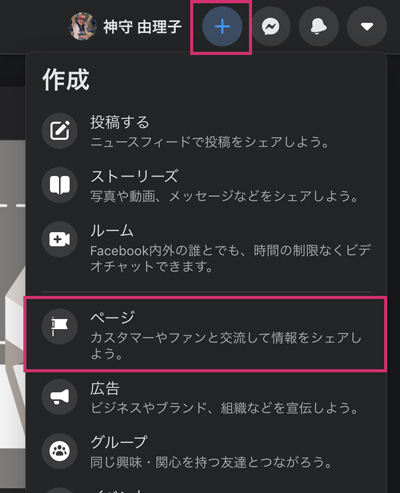

すでにページを持っているようであれば、アカウントが管理者かアナリストである必要があります。

### インスタはクリエーターないしはプロアカウントへ変更
インスタのアカウントを変更します。私はスマホから取得しました。

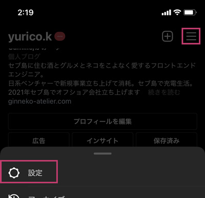

設定からプロアカウントに切り替えます。

クリエイターかビジネスを選べます。ケースバイケースで選びましょう！


### Facebookと連携させる
インスタ側からfacebookと連携させます。

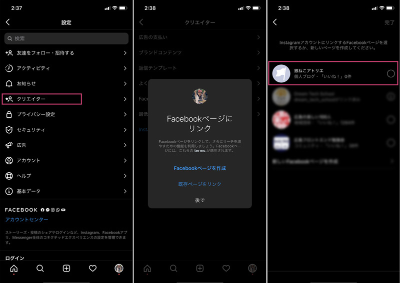

連携できたら、Facebookページ側から確認します。必ずリンクが連携できているか確認しましょう。

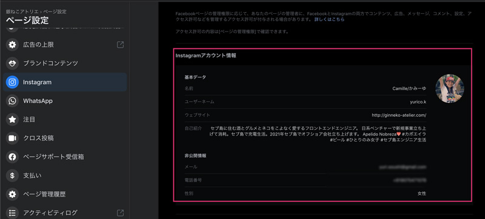

## ディベロッパー用のアカウント作成・アクセストークン等取得
この先は、一覧を表示するために必要なアクセストークンなどを取得します。

FACEBOOK for DeveloperはFacebookアカウントを持っていることが前提条件です。

[FACEBOOK for Developer](https://developers.facebook.com)


こまごまと設定は必要ですが、重要なのは*アクセストークン*と*インスタのビジネスアカウントID*を取得することです。

### アプリ作成

「マイアプリ」から新規で「アプリを作成」から新規のアプリを作ります。

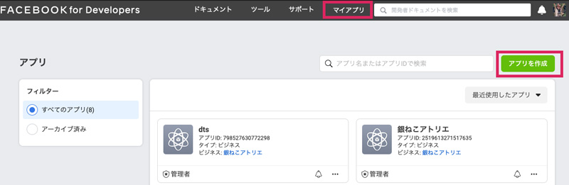

アプリ表示名を入力、アプリの目的を選択し、アプリを作成します。

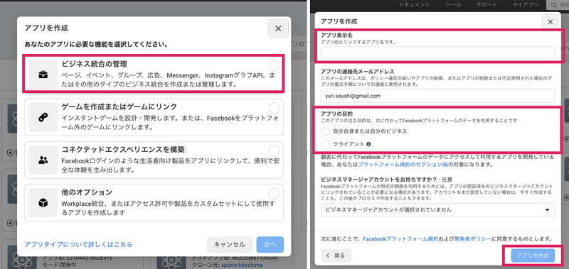

ちなみにアプリ名に「insta」を含むとエラーになり作成できません。おそらく盲点なので注意です。

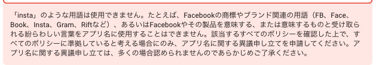

<div class="box">
<h4>あらかじめ「アプリID」、「app secret」をメモっておく！</h4>
この時点で、アプリの設定から、「アプリID」、「app secret」を必ずメモっておきましょう。マイアプリから対象のアプリを選択、設定のベーシックから<em>アプリID</em>と<em>app secret</em>を確認できます。

<p><span class="gatsby-resp-image-wrapper" style="position: relative; display: block; margin-left: auto; margin-right: auto; max-width: 630px; ">
      <span class="gatsby-resp-image-background-image" style="padding-bottom: 30.37974683544304%; position: relative; bottom: 0; left: 0; background-image: url('data:image/jpeg;base64,/9j/2wBDABALDA4MChAODQ4SERATGCgaGBYWGDEjJR0oOjM9PDkzODdASFxOQERXRTc4UG1RV19iZ2hnPk1xeXBkeFxlZ2P/2wBDARESEhgVGC8aGi9jQjhCY2NjY2NjY2NjY2NjY2NjY2NjY2NjY2NjY2NjY2NjY2NjY2NjY2NjY2NjY2NjY2NjY2P/wgARCAAGABQDASIAAhEBAxEB/8QAFwABAAMAAAAAAAAAAAAAAAAAAAECBf/EABQBAQAAAAAAAAAAAAAAAAAAAAD/2gAMAwEAAhADEAAAAd2QqD//xAAWEAADAAAAAAAAAAAAAAAAAAAAARD/2gAIAQEAAQUCjP/EABQRAQAAAAAAAAAAAAAAAAAAABD/2gAIAQMBAT8BP//EABQRAQAAAAAAAAAAAAAAAAAAABD/2gAIAQIBAT8BP//EABQQAQAAAAAAAAAAAAAAAAAAABD/2gAIAQEABj8Cf//EABcQAAMBAAAAAAAAAAAAAAAAAAAQMUH/2gAIAQEAAT8h1Uf/2gAMAwEAAgADAAAAEPAv/8QAFBEBAAAAAAAAAAAAAAAAAAAAEP/aAAgBAwEBPxA//8QAFBEBAAAAAAAAAAAAAAAAAAAAEP/aAAgBAgEBPxA//8QAGhAAAgIDAAAAAAAAAAAAAAAAAREAITFhcf/aAAgBAQABPxBIBqKxldlFE//Z'); background-size: cover; display: block;"></span>
  
    </span></p>
</div>

### Graph APIアクセストークン取得
アクセストークンを作成します。グローバルメニューのツールから「グラフAPIエクスプローラ」を選択します。

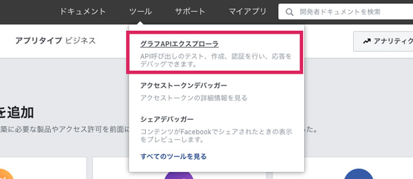

「グラフAPIエクスプローラ」に移動したら、先ほど作成したFacebookアプリを選択します。

「Generate Access Token」ボタンを押すと、ログインしろって言われるかもしれませんので（パスワードとか忘れないでね）その際はログインします。これでアクセストークンを発行できます。


「ユーザーアクセストークン」から、どんな許可を得たいかを選択します。

| Events Groups Pages|内容|
|-|-|
|`pages_show_list`|アクセス許可を使用すると、利用者が管理しているページのリストにアクセス可能になる。|
|`business_management`|ビジネスマネージャAPIを利用した読み取りや書き込み可能になる。|

| そのほか|内容|
|-|-|
|`instagram_basic` |プリがInstagramアカウントのプロフィール情報やメディア可能になる。|
|`instagram_manage_comments`|ページにリンクしたInstagramアカウントに代わって、アプリがコメントを作成する、削除する、非表示にすることができるようになります。また、ある事業主が写真にタグ付けされたり@メンションされたりした公開メディアや公開コメントをアプリが読み取り、返信可能になる。|
|`instagram_manage_insights`|FacebookページにリンクされたInstagramアカウントのインサイトにアプリがアクセス可能。また、他のビジネスプロフィールのプロフィール情報やメディアをアプリが発見し読み取ることも。|

さらに詳しい許可の種類は[こちら](https://developers.facebook.com/docs/permissions/reference)から確認できます。

### 更新が面倒なので無期限トークン取得
残念なことに、このアクセストークンはデフォルトで一時間しか使えません。

まあ、スーパー寿命が短いです。セキュリティ関連のせいだと思います。

期限を選べるらしいですが、とても面倒なので無期限に切り替えます。

寿命を伸ばすために必要なのは以下。

* アプリID  `{app_id}`
* app secret  `{app_secret}`
* アクセストークン  `{access_token}`

「グラフAPIエクスプローラ」のフォームに入力して送信します。


```
oauth/access_token?client_id={app_id}&client_secret={app_secret}&grant_type=fb_exchange_token&fb_exchange_token={access_token}
```

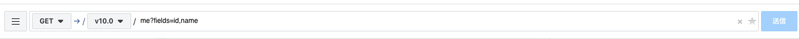

<small>※ アプリIDとapp secretの調べ方はこの記事内の[アプリ作成](/blogs/entry448/#アプリ作成)にあります。</small>

すると、こんな感じで値が返ってきます。

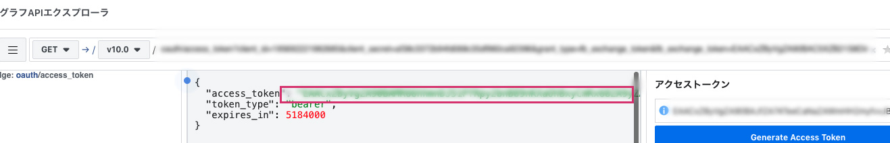

この値を使って`access_token`の無制限のアクセストークンを取得します。「Generate Access Token」をクリックで値が返ってきます。ログインを求められたらログインしてください。なんでこんなに面倒なのか不明。

ツールのアクセストークンデバッガーでアクセストークン情報を調べてきます。

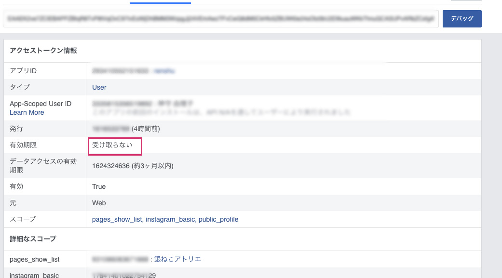


### インスタアカウントIDを取得
インスタのビジネスアカウントIDを調べます。古い記事だとここら辺の調べ方が違うので注意。

```
me?fields=accounts{instagram_business_account}
```

先ほど取得した*アクセストークン*と今取得した*インスタのビジネスアカウントID*でやっと一覧表示可能できます！
## インスタ投稿の一覧を表示してみよう
では、早速インスタ投稿の一覧を取得したいのでリクエストを投げてみましょう！

|値|概要|
|-|-|
|`{instagram_business_account}`|インスタのビジネスアカウントID|
|`{count}`|数|
|`{user_access_token}`|アクセストークン|

以下コードの{}のところをご自身のものに書き換えてください。


```
https://graph.facebook.com/v10.0/{instagram_business_account}?fields=name%2Cmedia.limit({count})%7Bcaption%2Cmedia_url%2Cthumbnail_url%2Cpermalink%7D&access_token={user_access_token}
```

`https://graph.facebook.com/v10.0/~`のv〇〇がGraphAPIのバージョンです。2021年3月時点最新はv10.0でした。

ブラウザーの検索窓に入力し、データ取得できるか確認してみます。


わーい！データが配列として返ってきましたね！

一応欲しいデータをちゃんとが取れているか念の為確かめておきましょう。`media_url`の値をブラウザー検索窓に入力して画像データが取得できたらOK。


ここまでできたらカンペキ。JSにもPHPでも表示可能です！！

取得できる値の一覧です。動画の時は要注意なので今回は分岐してサムネイル画像を表示しました。

|取得できる項目|説明|
|-|-|
|*caption*|投稿内容|
|*id*|投稿ID|
|*like_count*|いいねの数|
|*media_type*|メディアのタイプ。IMAGEとVIDEOがある。|
|*media_url*|メディアのURL|
|*permalink*|インスタへのリンク|
|*thumbnail_url*|サムネイル|

好き放題カスタマイズ可能です。

<div class="box">
<h4>値が返ってきたかを必ず確認してから次の作業しよう！</h4>
結構、こういったAPIの値が取得できてるかできていないかわからないまま作業している人がいます。ちょっと手間でも毎回、こういったポイントを通過することでミスやバグを潰せます。必ず確認しましょう。
</div>

#### 共通CSS

FontAwesomeなどを活用してます。以下は例です。適当に自分の好みにスタイリングしてください。

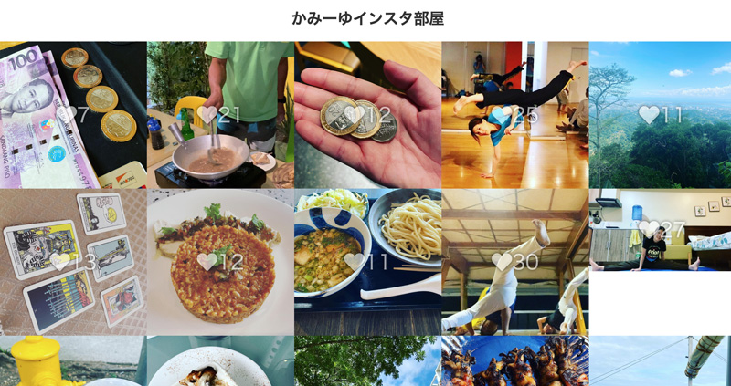

```css
ul {
  display: flex;
  flex-wrap: wrap;
}
li {
  list-style: none;
  width: 20%;
}
img {
  max-width: 100%;
  height: auto;
  display: block;
}
li a {
  position: relative;
  display: block;
}
li a .like {
  position: absolute;
  width: 100%;
  height: 100%;
  left: 0;
  top: 0;
  display: flex;
  align-items: center;
  justify-content: center;
  font-size: 40px;
  color: #fff;
  opacity: 0.6;
  text-shadow: 0 0 7px #000;
}
h1 {
  text-align: center;
  font-size: 30px;
  font-weight:bold;
  padding: 30px;
  color:#333;
}
```

### PHPコードサンプル
先ほどGraphAPIから取得したデータを元に出力してみましょう！

今回は*cURL関数*を使います。この関数を使うとPHPで、HTTPリクエストによる外部サイトとの送受信処理が可能です。

PHPでは以下のように実行してみました。

1. セッション初期化
2. 送用オプション設定
3. セッションを実行<br><small>（CURLOPT_RETURNTRANSFERを設定するとサーバから取得した情報を保存可能）</small>
4. ハンドルのセットを閉じる

```php
curl_setopt ( CurlHandle $handle , int $option , mixed $value )
```
[curl_setopt | php](https://www.php.net/manual/ja/function.curl-setopt.php)


```PHP
$list = "";
$instagram = null;
$id = {instagram_bussiness_account_ID};
$token = {user_access_token};
$count = {表示数};
$url = 'https://graph.facebook.com/v10.0/' . $id . '?fields=name,media.limit(' . $count. '){caption,media_url,thumbnail_url,permalink,like_count,comments_count,media_type}&access_token=' . $token;
$curl = curl_init();
curl_setopt($curl, CURLOPT_URL, $url);
curl_setopt($curl, CURLOPT_CUSTOMREQUEST, 'GET');
curl_setopt($curl, CURLOPT_RETURNTRANSFER, true);
$response = curl_exec($curl);
curl_close($curl);

//エラー
if($response){
  $instagram = json_decode($response);
  if(isset($instagram->error)){
    $instagram = null;
  }
}

foreach($instagram->media->data as $value){
  //メディアのタイプがビデオの場合、サムネを取得
  if($value->media_type=='VIDEO'){
    $src=$value->thumbnail_url;
    $video = '<span class="video"></span>';
  }
  else{
    $src=$value->media_url;
    $video = "";
  }

  $list .= '<li><a href="'.$value->permalink.'" target="_blank">caption.'">'.$video.'<span class="like"><i class="fa fa-heart"></i>'.$value->like_count.'</span></a></li>';
}
echo '<ul>' . $list . '</ul>';
```
### JSコードサンプル（jQuery）
```html
<script src="https://ajax.googleapis.com/ajax/libs/jquery/3.6.0/jquery.min.js"></script>
```
jQuery使ってサクッと取得してみましょう！CDNからソースコードを取ってきます。

```js
$(function(){
  const limit = 10; //表示件数
  const accessToken = {user_access_token}; // アクセストークン
  const businessID = {instagram_bussiness_account_ID}; //instagram_business_accountのID
  const url = `https://graph.facebook.com/v10.0/${businessID}?fields=name,media.limit(${limit}){caption,media_url,thumbnail_url,permalink,like_count,comments_count,media_type}&access_token=${accessToken}`;
  $.ajax({
    url: url
  }).done(function(res) {
    console.log(res.media);
  });
});
```
コンソールログで確認すると、ちゃんとデータ取れています。


取得したインスタ投稿データ一覧を格納するラッパーを作っておきます。

```html
<div id="insta"></div>
```
格納する投稿データを`$.ajax()`で取得し、ID instaの`div`タグに格納するコードです。

```js
$(function(){
  let list = '';
  const limit = 20; //表示件数
  const accessToken = {user_access_token}; // アクセストークン
  const businessID = {instagram_bussiness_account_ID}; //instagram_business_accountのID
  const url = `https://graph.facebook.com/v10.0/${businessID}?fields=name,media.limit(${limit}){caption,media_url,thumbnail_url,permalink,like_count,comments_count,media_type}&access_token=${accessToken}`;
  $.ajax({
    url: url
  }).done((res)=> {
    const data = res.media;
    $.each(data, function(index, val) {
      $.each(val, function(i, item) {
        console.log(item);
        if(item.media_url){
          //メディアのタイプがビデオの場合、サムネを取得
          media = (item.media_type == 'VIDEO' ? item.thumbnail_url : item.media_url);

          // 一覧を変数listに格納
          list +=
          `<li>
            <a href="${item.permalink}" target="_blank" rel="noopener">
            
            <span class="like"><i class="fa fa-heart"></i>${item.like_count}</span></a>
          </li>`;
        }

      })
    });
  $('#insta').html(`<ul>${list}</ul>`);
  }).fail(function(jqXHR, status) {
    $('#insta').html('<p>読み込みに失敗しました。</p>');
  });
});
```

## まとめ
長くなりました。インスタ投稿の一覧取得方、PHPとJSのサンプルコード両方紹介しました。

ウェブサイトにインスタの一覧を表示できたら超いいですよね！サイトを更新しなくても画像が常に更新されるのでリッチに見えます。クライアントも喜びます。

また仕様変更に気づいたらメンテ入れます！

最後までお読みくださりありがとうございました。
