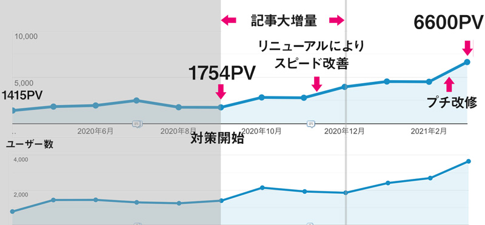
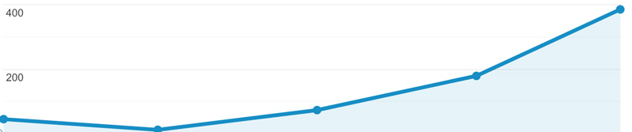
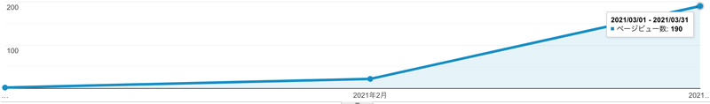
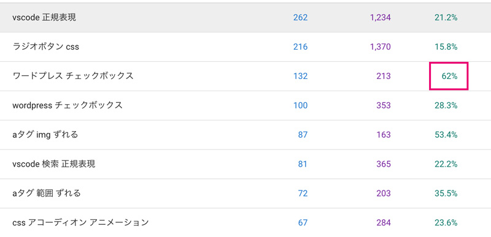

## この記事はブログ初心者向けです

サイト銀ねこアトリエのSEO対策レポートは、以下のような人にオススメ。

* 毎日記事を書きたくない
* ブログは多少趣味の域
* 何かに特化した記事を書いている人

半年前はPV数月間1,700でしたが現在月間6,500です。

## 半年のサマリー

半年間の概要です。

* スタート3か月でダメ記事を（40記事）削除、記事増（40記事）。対策後3か月以降から安定してPVが伸び始めた
* 速度改善のため静的サイトジェネレーターに切り替えた。直帰率（90% => 75%）や離脱率（87% => 63%）が改善
* PCからの流入多めなので3月のプチリニューアル。ブログだけ2カラムレイアウトに変更。
* 10〜12月大量に書いた記事のいくつかが徐々にPVが伸び始め、3月一気にPV増。時限爆弾みたいでびっくりした

## 数字を分析し、期間を区切ってどんな対策をするかを決めた

今回3か月ごとに何をするか明確にして行動したのが良かったです。たとえば、ゴールが3か月以内に5,000pvとかやってたら死んでたと思います。

### 事前に課題抽出
始める前にアナリティクスやサチコの数値を参考に課題の抽出しました。

アナリティクスや幸子から以下の問題がわかりました。

1. 見られていない質の悪い記事が多すぎる
2. 直帰率が高い
3. ページの表示スピードが遅い

前半3か月は記事を増やすことに専念し、後半に増やした記事などでPDCAを回してリライトしていくことにしました。

### 前半・基盤づくり
|月|やったこと|
|-|-|
|2020年10月|新規4記事（ヤル気なかった）|
|11月|新規15記事|
|12月|新規20記事・40記事削除 デザインはそのまま静的サイトジェネレーターへ作り直し|

* 直帰率を下げるために、0秒で直帰されている記事と見られていない記事を選定しリライトに値しないものは削除。
* 削除した分記事が減るので増やす。月15記事を目標に書く。

### 後半・PDCAを回す
|月|やったこと|
|-|-|
|2021年1月|新規11記事・リライト3本|
|2月|新規6記事（ヤル気なかった）|
|3月|新規9記事・リライト3本・3記事削除 トップ&ブログデザインプチリニューアル・ヒートマップ導入|

* 公開後3か月以上経った記事でsearch consoleでは上位表示されているにもかかわらず、直帰率の高い記事を月2 ~ 3ピックしてリライト
* 前半書いてPVの伸びの良かった記事を参考に記事を書く。8 ~ 10記事まで
* ヒートマップ導入し、ユーザーの動きを研究。トップとブログページのプチリニューアルした

## 半年間のSEO対策でわかったこと
半年間毎日数字を見て私なりにわかったことがあります。

### PVを稼ぎたいならPVを稼ぐ記事を増やせばいい

この半年間でわかったのは記事がクロールされてからオーガニックサーチでPVが伸び始めるまで平均3か月くらいかかります。

<small>※ 11月公開の記事。4か月後月間400PVまで成長。</small>

<small>※ 1月公開の記事。2か月後月間190PVまで成長。</small>

 さっさとPV伸ばしたいかもですが、バズ狙うのって堅実じゃないしギャンブルだと思います。

バズらなくても月間平均500PVぐらいの記事が増えれば、サイト全体のPVは伸びるわけです。

月間平均500pvの記事を10記事以上増やすことができれば少なくとも10,000pvは達成できると思います。

### 何かに特化した記事でさらにニッチを狙うとオーガニックサーチで流入が増える

記事には*雑記型*、*特化型*、*トレンド型*と大きく分けられます。

私は運がいいことに昔からテック記事・特化型の記事をたくさん書いています。

こちらはサチコ（Google Search Console）の検索パフォーマンスデータですが、クリック率が62%って半数以上です。

会社勤めだった頃はクライアントのサイトもたくさん運用もしてきましたがこんな数字見た事ないので結構驚異的です。

ただ私の記事はマニアックものが多いせいか表示回数は少なめです。もっとメジャーなカテゴリーにしたらクリック率などは一気に下がると思います。

もちろん雑記型（日々の思いなど）も書きますが、ぶっちゃけ伸びません。

## 6月までにやる事
この3か月数値を計測して、次の3か月やることを決めました！

* ヒートマップの録画データによるとコードサンプルが長すぎて離脱している ↓↓ コードサンプルを折りたたみ式に
* いくつか直帰率が上がっている ↓↓ コンテンツ見直し（月2 ~ 3本）
* Aboutへの流入増加 ↓↓ Aboutページの改修
* 不要ページの見直し削除もしくはリライト
* 月ブログを8~10本公開

## 感想とまとめ
ちなみに始めた頃の目標は**5,000pvを越えること**で、達成できました！！

最初の記事を増やす作業が一番しんどかったです涙。同時進行で、スピード改善のためリニュアルもしていたので。

とはいえ、じわじわでも結果が出ていくのは楽しいですし、データが蓄積されてくるとそれを元に改善策を考えるのもワクワクします。

たとえ1000pvとか100pvだとしても誰かがサイトを閲覧してくれている感謝を忘れてはいけませんね。

この記事はほぼほぼ自分のために書きましたが、今記事のPVが伸び悩んでる方への一助となれば幸いです。

最後までお読みいただきありがとうございました。
