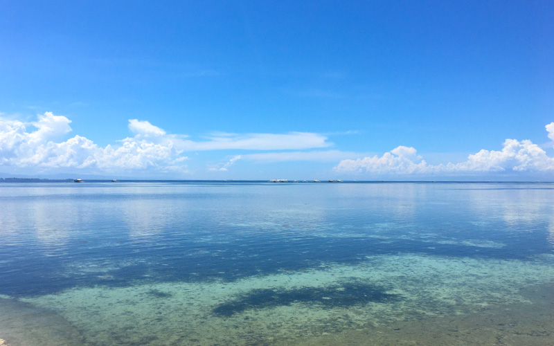

## 自由になりたい！海外ノマドになりたい！でも、実務経験ってぶっちゃけ必要なの？
現在、会社員から解放されたくて頑張っている駆け出しエンジニアの方へ。

ネットさえつながればどこでも仕事ができる！そう思ってプログラミング勉強している多いはずです。

ネットがつながればどこでもいい。。。つまり海外でも大丈夫じゃない？

そんな発想になる方もいるはずです。

一番気になるところは*経験が必要かどうか*ではないでしょうか？

私（経験10年）や周りの事例と合わせてご紹介します。

### 実務未経験だけど大丈夫？
もちろん、*実務経験があるに越したことはない*です。

ただそれ以上に実は大切なものがあります。**コネを作る力やコミュニケーション能力**です。  

* コミュニケーション能力がある
* SNSなどで発信力がある
* 愛嬌・人柄

 上記3つが備わっていたら完ぺきです。

私の知り合いにほぼ未経験から海外ノマドとして暮らしている人もいます。  

実際、案件が取れなかったらどうしようって不安がありますよね？

*物価の安いアジア圏*に住み*150万円以上貯金がある独身の方*であれば、案件が取れなくても*約1年は生存可能*です。

なので、スキルが足りなくても1年間は勉強しながら案件獲得にチャレンジし続けることができます。  

ちなみに未経験の方に絶対習得してほしいスキルがあります。

HTML・CSSだけじゃなく**WordPressをしっかり勉強**してください。最低テーマくらいは作れるようになっておきましょう。

WordPress案件は需要が多く、クラウドソーシングサービスでも安定した金額で取れる事が多いです。

不安な方はTech Academyさんなどのテックスクールで<a href="https://px.a8.net/svt/ejp?a8mat=3H9TGC+AM8B5E+3GWO+65U42" rel="nofollow">WordPressコース</a>
などで先に勉強することをススメします。1か月くらい勉強すればそこそこ習得できるとはずですよ！

### 実務経験あれば海外ノマドになれる？
残念ながら、経験があるだけでは**海外ノマドになれません**。

会社辞めていきなりフリーランスで海外ノマドやるぞー！とか考えている人、*超危険*です。  

* 実力や実績を証明できるしっかりしたポートフォリオを準備できる
* フリーランスや副業の経験がある
* コミュニケーション能力や発信力がある

最低上記がほしいところ。

 どうしてもチャレンジしたい方は日本にいる間、困った時に相談できたり案件を紹介してもらえそうなコネを作っておくことをオススメします。

ポートフォリオサイトだけではなく、PDFなどのデータも用意しておくことをオススメします。  

ちなみに私は現在紹介のみで仕事を獲得しています。

## 海外ノマドのメリット＆デメリット
私が住んでいる物価の安い東南アジア圏を例に、メリット・デメリットをご紹介します。

| | 詳細 |
|-|-|
| *メリット* |・多少案件が取れなくても経済的な不安が少ない ・生活費が安い ・住宅が家電付き |
| *デメリット* | ・政治や国の状況に左右される ・ネットが不安定な可能性あり ・治安やあらゆるサービスが日本に劣る |

一番嬉しいことは物価が安いおかげでお金の不安があまりありません。月一案件が取れさえすれば十分生活できます。

*摩耗するほど仕事をしなくていい*ので*ストレスフリー*。

食事・文化・言語・治安の壁を超えるタフさがあれば問題ないです。

<a class="article-link" href="/blogs/entry417/">
<section>

海外は治安が悪い？！住む場所を選んで上手に海外生活する方法

将来海外移住を考えている方へ。フィリピンでは最長3年間観光ビザで滞在できるってご存知･･

<time datetime="2020-12-15">2020.12.15</time>

</section></a>

ちなみに言語の壁は公用語が英語の国であれば中学英語ぐらいできればなんとかなります。

## 海外でどうやって仕事を獲得する？
ちなみにどうして私が紹介で仕事を獲得しているかというと理不尽な案件がなくて安心！という理由です。

とはいえみんなが紹介で案件を獲得できるわけではありません。  

そんな時はクラウドソーシングサービスを利用しましょう！

最近Twitterのタイムラインでココナラ使って稼いでるフリーランサーのTweetをよく見かけます。

ココナラでは<a href="https://px.a8.net/svt/ejp?a8mat=3BHPWW+3KMEQ+2PEO+1HO86Q" rel="nofollow">会員登録</a>
が無料でできます。

もちろん、ランサーズやクラウドワークスなどの老舗のクラウドソーシングサービスなどもあります。自分に合うサービスを海外に行くまでに試し、数案件こなして実績を作っておくと安心です！

ただクラウドソーシングサービスのデメリットは中間マージンを取られる上に安い案件も多いです。とはいえ住んでいる国の物価によっては十分生活できるので活用するといいです。

## おまけ・エンジニアだけじゃなくブロガーやYouTuberも海外ノマドに向いている！

現在コロナ禍で、以前のように海外へ気軽に行けなくなりました。

そのせいか今海外バーチャル旅行の動画の需要が増えてるみたいです。

すでに海外にいる住んでいる人にとってはチャンスでもあります。実際、フィリピンにはたくさん外国人YouTuberがいます。

私もコロナがきっかけで海外ノマド動画を配信始めました。

海外ノマドや女性エンジニアライフに興味がある方、ぜひご視聴ください。[チャンネル登録](https://www.youtube.com/channel/UCbSgjkCIPucux8cFTuQcdcw/videos)していただけたら飛び跳ねて喜びます！！！

<iframe width="560" height="315" src="https://www.youtube.com/embed/3lUQEzhWDzo" title="YouTube video player" frameborder="0" allow="accelerometer; autoplay; clipboard-write; encrypted-media; gyroscope; picture-in-picture" allowfullscreen></iframe>

## まとめ・海外ノマドはチャレンジする価値あり！
日本でフリーランス始めたものの案件が取れなかったり、想像以上の出費で諦めてしまう人も多いのではないでしょうか？

海外は日本と*物価が違い*、国によっては物価が安いので**お金の不安を解消**してくれます！

しかも最近では、東南アジアだけではなくジョージアなど、海外ノマドフリーランサーをチャレンジできる国が増えました。

海外ノマド・フリーランサーは目指す価値ありますが、物価が安いとはいえ案件を獲得できないと生活できなくなります。必ず向き不向きを見極めてください。

この記事が海外ノマドを目指す方の一助となれば幸いです。

最後までお読みいただきありがとうございました。
