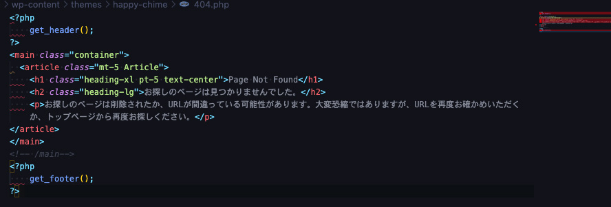
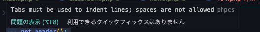
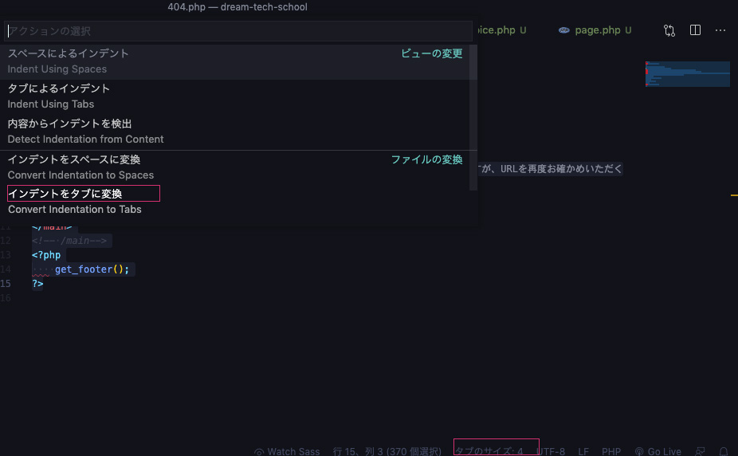
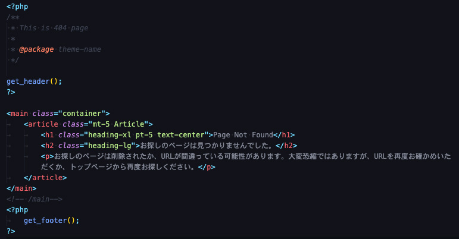

## 前提条件
この記事は前半と後半に分かれてます。

* Macでしか検証していません
* VS Codeを使うことが前提です。
* phpcsでWordPressコーディング規約導入したい方は[WordPress phpcsでコーディング規約を守る環境を作る](/blogs/entry450/)へ

### WordPressの各言語ごとのコーディング規約

WordPressにもコーディング規約があって、各言語ごとにまとめられています。気分が萎える。。。

* [html](https://ja.wordpress.org/team/handbook/coding-standards/wordpress-coding-standards/html/)
* [css](https://ja.wordpress.org/team/handbook/coding-standards/wordpress-coding-standards/css/)
* [JavaScript](https://ja.wordpress.org/team/handbook/coding-standards/wordpress-coding-standards/javascript/)
* [PHP](https://ja.wordpress.org/team/handbook/coding-standards/wordpress-coding-standards/php/)

## ファイルの整形

WordPressにはheader.phpなどのテンプレファイルがあります。

過去に書いた404ページですが見事に真っ赤になりました。誰だ、こんなクソコード書いたやつ。。。**お前だよ！！！**



赤い箇所にカーソルを当てるとエラーがわかります。ただし英語です。



> Tabs must be used to indent lines; spaces are not allowed. ~ タブを使用してください。スペースは許可されていません~

Google翻訳にかければ理解できると思うのですが、9割くらいはインデントやスペースの使い方のエラーです。

インデントやスペースのエラーは[WordPress phpcsでコーディング規約を守る環境を作る](/blogs/entry450/)で環境設定した自動フォーマッターを適応するだけで*ほぼほぼ解決*します。

フォーマッター使用後も多少コードが乱れることもあるので手直しは必要です。

それでも困ったらエラーを読み解くか、[WordPressコード規約（PHP）](https://ja.wordpress.org/team/handbook/coding-standards/wordpress-coding-standards/php/)で調べます。

もし入れてない場合は、スペースをタブ変換します。WordPressのインデントはハードタブ（4つ）です。




## よく遭遇するエラーと対処法

よく遭遇するエラーをケース別にまとめます。

### Missing file doc comment/ファイルに説明追加
WordPressのコーディング規約ではファイルの冒頭にミニマムでファイルの説明を入れる必要があります。

何のパッケージに含まれるかも必須です。

```php
<?php
/**
 * This is 404 page（ページの説明。英語の場合は頭文字は大文字から）
 *
 * @package theme-name（パッケージ名）
 */

/** こっからコード
*/
```

コードとコメントは一行空けます。

コメントは`/**`と入力すると以下のように展開されます。

```php
/**
 *
 */
```

理想のコメント。
```php
/**
 * ファイルのタイトル
 *
 * ファイルの説明.
 *
 * @category   Components
 * @package    WordPress
 * @subpackage テーマ名
 * @author     名前 <foo.bar@example.com>
 * @license    https://www.gnu.org/licenses/gpl-3.0.txt GNU/GPLv3
 * @link       https://example.com
 * @since      1.0.0
 */
```



### Missing doc comment for function 関数名/関数に説明追加

function.php内で発生しがちの関数系のエラーです。

関数説明の追加は拡張機能の*PHP DocBlocker*を入れておくと便利です。


関数を書いた後に関数の上で`/**`コメント展開したら以下追記されるので、適宜リライトしてください。
```php
/**
 * Undocumented function
 *
 * @param [type] $arg
 * @return void
 */
```
必ず冒頭になんの関数か説明を追記してください。

テンプレートファイルの説明と違って、コメントと関数を続けて記述します。

```php
/**
 * 説明
 */
function my_function() {
	$hogehoge;
}
```

補足ですが、通常一般的なPHP（PSR2など）では`{`を改行するのに対し一行で書くのがWordPress仕様です。この辺はフォーマッターで解決できます。

引数がある場合はその説明の追記も必要です。引数の説明を終わらせるために`.(ピリオド)`を打つ必要があります。

```php
/**
 * 説明
 *
 * @param string $value は値です.
 * @param string $name is name.
 * @return $hogehoge
 */
function my_function( $value, $name ) {
	return $hogehoge;
}
```


## phpcsで気づいたWordPress NGコード
phpceを導入してNGコードにたくさん気づけたので抜粋しておきます！

### 変数のecho書き出しはNG

`echo`出力やりがちなんですが、まんま出力はセキュリティ上NGです。

phpcsでコード書いてるとここら辺も怒られます。

> All output should be run through an escaping function (see the Security sections in the WordPress Developer Handbooks)

なのでエスケープ処理（除去）をかませます。他にもありますが、よく使う3このみ抜粋。

|関数|説明|
|-|-|
| `esc_html()`| htmlタグをエスケープ|
| `esc_url()`| URLのプロトコルのチェックや適切でない文字をエスケープ|
| `wp_kses()`| 特定のタグと属性の出力以外エスケープ|

たとえば、`get_the_title()`で取得した投稿内容を`echo`出力したい場合はこんな感じです。

`get_~`系の関数出力はすべてエスケープ処理が必要だと思っておいてもいいくらいです。

```php
echo esc_html( get_the_title() );
```
URLではこんな感じで使います。
```php
<a href="<?php echo esc_url( home_url('/') ); ">ホーム</a>
```
特定のタグや属性だけ残したいときはこんな感じ。

brタグだけスリップできます。

```php
$address = nl2br( $address );
echo wp_kses( $address, array( 'br' => array() ) );
```

長くなる場合はまとめるといいかもです。属性はタグの`array`内に記述します。

```php
<?php
$allowed_html  = array(
	'iframe' => array(
		'src' => array(),
	),
);
?>

<div class="iframe"><?php echo wp_kses( $get_map, $allowed_tags ); ?></div>
```

### ミスを避けるためヨーダ記法をゴリ押しされる

> Use Yoda Condition checks, you must.

if文でヨーダ記法といって値を先に書く方法があります。

いわゆる倒置法。

```php
if ( 3 === $yoda ) {
/*
 * 続き
*/
}
```
変数の代入と間違えてif文を書来がちなのでこの記法で書けと言われますが、たまにしか間違えんです汗

#### 後から大量にヨーダ記法に書き換えるのが辛い人へ。奥の手置換

ちなみに私は大量のヨーダ記法への書き換えが辛かったです。途中で気づいて置換しました。こちらにやり方を記載しました。

<a class="article-link" href="/blogs/entry336/">
<section><div class="article-link__img"></div><div class="article-link__main">
<div class="article-link__main__title">VS Codeでカンタン！正規表現置換のためのチートシート</div>
<p class="description">コードをいわゆる「置換（置き換え）」、一気に変換したい！ってときありませんか？「正規表現」を使うと･･</p>
<p>
<time datetime="2019-07-21">2019.07.21</time>
</p>
</div>
</section></a>


### 演算子は厳格に使え！

これは当たり前っちゃ当たり前なんですが、うっかり間違えて`==`とか`!=`、使っちゃいます。

> Found: ==. Use strict comparisons (=== or !==).

```php
if ( $neko === $cat ) {
/*
 * 続き
*/
}

if ( $inu !== $cat ) {
/*
 * 続き
*/
}
```

ショートタグから取得したタグは`true`や`false`がboolean（論理型）からstring（文字列）に変換されているので、文字列として判定する必要があります。

```php
if ( 'true' === $cat )
```

### 配列は[]じゃなくarrayで書け！

> Short array syntax is not allowedphpcs

[]で書くほうがモダンだと思いきや、使用NG。

```php
NG
$array = [
];

OK
$array = array(
);
```
### キャメルケースはNG！
JS書いてるとついついうっかりキャメルケース書いてしまいますがNGです。

変数名や関数名はスネークケースで書きます。

```php
NG
$metaDescription
myFunction()

OK
$meta_description
my_function()
```

### ループ条件内で関数を使うな

> the use of count() inside a loop condition is not allowed; assign the return value to a variable and use the variable in the loop condition instead.

ループ条件内でのcount（）をまんま使ったら怒られました。

```php
NG
for ( $i = 0; $i <=  count( $array ); ++$i ) {
	処理
}

OK
$cnt = count( $array );
for ( $i = 0; $i <= $cnt; ++$i ) {
	処理
}
```

### ショートコードの引数の書き方注意
ショートコードで使っていた鉄板の`extract()`は使用を推奨されていないようです。

古い書き方も注意されるので、発見があります。

> extract() usage is highly discouraged, due to the complexity and unintended issues it might cause. ~ extractは非常にオススメできません。複雑な問題（多分バグ）があるから使わない方がいいです。~

代替コードはこちらです。

```php
function show_archives( $atts ) {
	$atts = shortcode_atts(
		array(
			'order'       => 'DESC',
			'type'        => 'post',
			'cnt'         => -1,
			'author_name' => '0',
			'pager'       => false,
			'slider'      => false,
		),
		$atts
	);
//省略
}
```

こんな感じで値を取得します。

```php
$atts['order']
```

## どうしようもないエラーを非表示にしたい

やりたくないけど、どうしてもチェックを無視したいときは以下を使います。

一部無効（私はどうしてもの時基本これしか使いません）。
```php
// @codingStandardsIgnoreStart
$test = $_GET['test'];
// @codingStandardsIgnoreEnd
```
ファイルまるごと無視
```php
<?php
// @codingStandardsIgnoreFile
```
フォルダー丸ごと無視
```
phpcs --ignore=*/tests/*,*/data/* /path/to/code
```

## まとめ・規約に添えば正しいコードが書けるようになる
他にもたくさんエラーに見舞われたのですが大量すぎて忘れました。

気づいたら追記します。

英語のエラー潰しはツライはず。ぜひこの記事を参考にしてWordPressコーディングライフを楽しんでください。

最後までお読みいただきありがとうございました。
