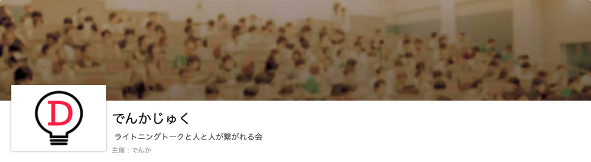
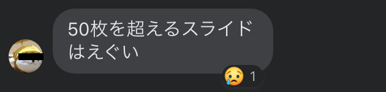
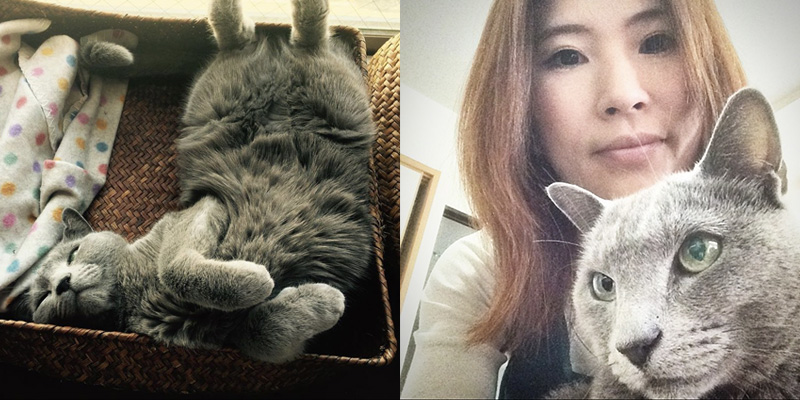

## 広島のこぢんまりとしたIT勉強会・でんかじゅくとは？

でんかじゅくとは、でんか主催の広島にあるこぢんまりとした、LT中心のIT勉強会です。connpassより抜粋。

> 自分の考えや意見を伝え、誰かの考えや意見を聞いて、新しい何かを発見する会です！ 
> 加者全員が・・＼楽しくコミュニケーション／を取れる環境を目指しています！

[でんかじゅく](https://denkajuku.connpass.com/)

挨拶は*ヤッホー*。困ったり、窮地に立たされた時は*ぴえん*。最初は若者文化？についていけませんでしたが、*ぴえん*が少しずつジワるようになりました。

## 2021/04/17（土）「ただいま！でんかじゅく！！」の登壇者の紹介
今回は、主催者であるでんかと私の二人でした。

### でんか / 死亡寸前?!失敗だらけのマーケティング
でんか（[@sasga](https://twitter.com/sassga)）

ここ1年の失敗談をマーケティングと絡めたお話でした。  

いまだにテレアポ推奨する会社があるんだってびっくりします？

テレアポの話で*進撃の巨人の壁外調査員*というたとえが刺さりました。壁の外に出たらすぐ死亡する運命。。  

ちなみに、テレアポでブチぎり最短1秒切るとのことでした。切ない。。。

### かみーゆ（私） / かみーゆは見た！悪質SEOトップ3

私は今ハマってることと、SEOの基礎、実際体験した悪質SEOワースト3を紹介しました。

10分LTの予定だったのですが、スライド53枚量産してしまい15分以上も話してしまいました。

<small>※ しろたん師匠の一言。プライバシー保護の為、顔がわからないように保護してあります。</small>

 SEO業者のマインドや態度も含め話をしたかったので、あえて「対策」を外しました。

ざっくりとした内容です。

* *キーワード詰め込み* … 検索エンジンに評価されることが前面に出てますよね？キーワード詰め込みすぎてコンテンツが支離滅裂とかありえません。本来であればユーザーに評価されるべき。検索エンジンのアルゴリズムはユーザーに評価される記事を上位表示されるように日々アップデートされてます。Googleのエンジニアはエリート中のエリート。我々のような一般人の浅知恵なんて通じません。
* *データの隠蔽* … たまにサチコの導入を断る業者がいます。悪質以外に言いようがないですね。データを見せない会社は業務怠慢かブラックハットを隠蔽したいのじゃないかと思います。どちらにしてもアウト。
* *被リンク購入* … これも昔からあるブラックハットですね。被リンクは人様のサイトからリンクが貼られている、つまりそのサイトが紹介したいぐらい評価されているという指標になります。自作自演するための方法が被リンク購入です。昔、Googleのアルゴリズムが今ほど発達してなかった頃、相互リンクとか流行ってました。被リンクだったらなんでもいいんですよ。大抵そんな場合はいかがわしいサイトからの被リンクも含んでるのでブラックハットだと気づきます。

こちらは当日のスライドです。

<iframe src="//www.slideshare.net/slideshow/embed_code/key/HRwtUFv4QhPsX7" width="595" height="485" frameborder="0" marginwidth="0" marginheight="0" scrolling="no" style="border:1px solid #CCC; border-width:1px; margin-bottom:5px; max-width: 100%;" allowfullscreen> </iframe> 
 <strong> <a href="//www.slideshare.net/yurikamimori/seo3-246371798" title="かみーゆは見た！ブラックSEOトップ3" target="_blank">かみーゆは見た！ブラックSEOトップ3</a> </strong> from <strong><a href="https://www.slideshare.net/yurikamimori" target="_blank">Yuriko Kamimori</a></strong> 

### 相互フォロー・リンクや被リンク＆フォロワー購入に対して思うこと
**目的は手段を正当化する（The end justifies the mean）**ってことわざありますが、目的のためならモラルを欠く行動する人があまりにも多い。  

*人が一番邪悪*。  

Twitterでも最近相互フォロー、フォロバとかハッシュタグ見かけます。時代や媒体が変わっても結局人って心理が一緒ですよね。中にはTwitterのフォロワーを買う人もいるらしいです。

おそらく非アクティブで自分のファンでもないアカウントなので価値のないフォロワーです。なんだかなーって感じでした。

本気で発信して、それがきっかけで得た被リンクやフォロワーこそ価値があると思います。

## 当日の質問を少し紹介
久々の広島の人との交流で当日たくさん質問いただきました。

当日はたくさんご質問いただきありがとうございました！

こちらに覚えている限り&出せるものだけまとめます。

### 「銀ねこアトリエ」の由来ってなんですか？
元旦那の飼っていたロシアンブルー・こじろーが灰色の猫だったからです。

昔は空き時間に個人でネイルサロンをやっていて、そこが銀ねこアトリエって名前でした。実は技術系のブログは元々*銀ねこアトリエAnnex（別館）*という名前でした。

余談ですが、最初はFC2ブログから始まり、すぐにドメイン取ってconcrete5でどうしてもブログサイトを構築したくてググりまくってカスタマイズしてテーマ作りました。その後なんとか記事を書き始めたのが始まりです。

<small>※ 実際のこじろー。そして私、若いわww</small>

### 普段業務でJS使わないからもっと勉強したい
置いていかれるのが嫌なら強制的に自分を追い込め！

やっぱり自分でブログサイトなどを自作してコンテンツをアウトプットするのが一番だと思うんです。  

このサイトは自分を追い込むために作りました。もちろん、AnalyticsやSearch ConsoleだけじゃなくHotJarなど、Heat Mapツールも入れてます。

発信するのが楽しい！**1か月10記事程度を目標**に掲げ更新しています（運用7年目）。

ブログ運用をすると副産物もあります。解析ツールを読み解くと経験値が上がります。

どこで離脱されているかなどユーザビリティやUIで問題も見つかります。  

これこそ*改修・技術を磨くチャンス*です！  

もちろん学んだことをブログでアウトプットするのも勉強になります。

実務でやる機会がなくても、どうにか常に勉強する機会を設けるようにしています。

### かみーゆさん、何やってる人なんですか？
昨年会社を退職し、3か月ほどぷーしてました。海行ったり、大切な人たちと過ごしたり＆呑んだくれたり、セブを観光したり…。

ロックダウンでフィリピン人の雇用について問題を感じていました。去年末、今のビジネスパートナーと「フィリピンに雇用を生む！」と決意し、セブ島に残りました。

<small>※ フィリピンはコロナウィルスのせいで世界最長ロックダウン（往来の制限や街の封鎖）中。昨年8月、最大約50%（非公聞込調査結果）の失業率に見舞われたが、No Work No Pay（自宅待機で給料支払いなし）を実施する会社も多く実際はもっと困窮した。</small>  

今は会社設立したいのでお金を貯めるためにビジネスパートナーとそのための仕事をしています。  

とはいえ、*私たちのメンタルが健やかであることも前提条件*。なので無理ない範囲で仕事しています。

結果、通勤時間、ムダな会議やメール文化、思考停止するような社則から解放されました。  

なんとなく得た環境ではありますが学びは、**仕事って自分を幸せにするツール（所詮手段）**ということ。手段に支配されたら終わりです。

### テキストメッセージについて
[リコネクト](https://www.rcnt.jp/)の北村社長がいいことおっしゃってましたね！

感情を排除する。業務のやり取りではとても大切です！すぐキーーーって感情的になる私にもとても刺さりました。

*たとえク●野郎！！*って心で思っていても、テキストで伝えるときは感情を排除しようと心がけることにしました。  

私は質問に答える時間がなかったので、この場で私の意見を少し。

テキストメッセージだけじゃなく、コミュニケーションって事実と意見の混在するから齟齬が生まれるって最近思います。

事実だけ話せばいいのに意見や予想が入っちゃうからトラブルになる。

なので、事実と意見を分けて述べるだけでもトラブル回避できる気がします。

## 最後に
今回でんかじゅくに10名程度ご参加いただき、久々に広島の人と交流できとても楽しかったです！！

「ブログ読んでます」って言われたのがとても嬉しかったです。

皆さんにたくさんのパワーをもらえ感謝。

今回、私を登壇させてくれたでんかにも感謝です！！！

また、ちょっとした勉強会などありましたらぜひお声がけいただけると幸いです。喜んで登壇します。

最後までお読みいただきありがとうございました。
