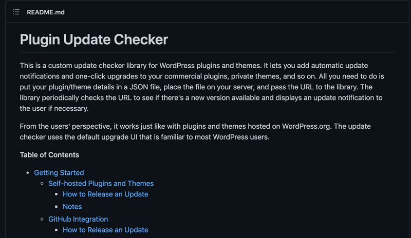
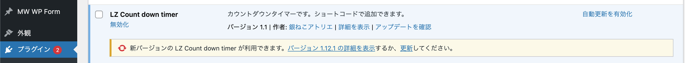
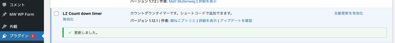

*この記事の対象者*

* 自作したプラグインの更新を一限管理したい
* GitHubでプラグインを管理したい
* 自作したプラグインを自動更新できるようにしたい

<div class="msg-baloon">
<p>かみーゆ</p>
<p>GitHubにリポジトリに自作したWordPressプラグインの更新を通知させたり自動更新可能にする方法を紹介します。</p>
</div>

<small>※ プラグインを作ることができて、GitHubアカウントを開設していることが前提条件です。<br>※ この記事は不十分なため追記予定です。</small>

めっちゃ簡単なプラグインの作り方はこちらになります。

<a class="article-link" href="/blogs/entry283/">
<section><div class="article-link__img"></div><div class="article-link__main">
<div class="article-link__main__title">WordPress で自作した機能を plugin 化してまとめると幸せになれた
</div>
<p class="description">WordPress のfunctions.php に書いていく、自作した機能をプラグインごとにまとめたらめちゃめちゃ便利だったのでその方法を･･･</p>
<p>
<time datetime="2018-08-14">2018.08.14</time>
</p>
</div>
</section></a>

## Plugin Update CheckerをGitHubからダウンロード

まずはPlugin Update CheckerをGitHubからダウンロード。


[Plugin Update Checker](https://github.com/YahnisElsts/plugin-update-checker)

the latest releaseから、Assetsが2つあるのでいずれかをDLします。

本日時点での最新は[4.11(5月16日更新)](https://github.com/YahnisElsts/plugin-update-checker/releases/tag/v4.11)でした。


今回は仮にmy-pluginというフォルダー内にプラグインを作っていきます。

```
/my-plugin
  ├ my-plugin.php
  ├ plugin-update-checker/ //Plugin Update CheckerのAssetsを解凍して格納しておく
  └ readme.txt
```
`my-plugin.php`がこのプラグインの起点となるとファイルになります。

`plugin-update-checker/`内に格納した`plugin-update-checker.php`を読み込みます。

```php
require 'plugin-update-checker/plugin-update-checker.php'; // 「Plugin Update Checker」をインクルード

$myUpdateChecker = Puc_v4_Factory::buildUpdateChecker(
	'https://github.com/【アカウント名】/【リポジトリー名】',
	__FILE__,//書き換える必要なしこの場合my-plugin.phpのフルパスが取得できます。
	'my-plugin'//プラグインのスラッグ
);
```

同期したいブランチを指定します。

```php
$myUpdateChecker->setBranch( 'main' );
```

これで指定したブランチにプッシュしたら、プラグイン側にも通知が来るようになります。





Plugin Update Checker公式ページに以下が書いてあります。

readme.txtを追加しておきましょう。

[the WordPress.org plugin readme standard](https://wordpress.org/plugins/readme.txt)

> Plugins only: Add a readme.txt file formatted according to the WordPress.org plugin readme standard to your repository. The contents of this file will be shown when the user clicks the "View version 1.2.3 details" link.<br>
> プラグインのみ：WordPress.orgプラグインのreadme標準に従ってフォーマットされたreadme.txtファイルをリポジトリに追加してください。このファイルの内容は、ユーザーが「バージョン1.2.3の詳細を表示」リンクをクリックすると表示されます。

プライベートリポジトリを更新対象としたい場合は一手間必要です。

アクセストークンを取得し、以下コードを追加。
```php
$myUpdateChecker->setAuthentication('your-token-here');
```

<small>※ アクセストークンの設定の仕方は後日追記します。</small>

## Assetsも自動更新にしたい
以下コードもを追記しておきます。
```
$myUpdateChecker->getVcsApi()->enableReleaseAssets();
```
## ガイドラインに違反？不安に思った方のために補足します
公式WordPressサイトに*Plugin Update Checker*に関する記事が見つかりました。

『WordPress.org 以外から配布したものに更新する機能』はマーケットプレースに出品するプラグインとしてはNGのようです。

Update機能はあくまで公式WordPressのマーケットプレースに出さない、自作プラグイン用として使うのがよさそうです。

[ガイドライン違反について](https://wordpress.org/support/topic/%E3%82%AC%E3%82%A4%E3%83%89%E3%83%A9%E3%82%A4%E3%83%B3%E9%81%95%E5%8F%8D%E3%81%AB%E3%81%A4%E3%81%84%E3%81%A6/)


## まとめ・自作プラグインの更新をまとめて管理できて便利
あくまで自作テーマやプラグインのアップデーターですが、バグや更新を一括でできるのはとても便利ですね。

この記事が、みなさんのコーディングライフの一助となれば幸いです。

最後までお読みいただきありがとうございました。
