私は昔から、こんな感じでGoogleドライブに同じ構造でフォルダーを作ってます。
```
案件/
 ├ プロジェクトA/
 │ ├ 議事録/
 │ ├ 受領物/
 │ └ 納品物/
 ├ プロジェクトB/
 │   ・・・
 └ プロジェクトC/
      ・・・
```
<div class="msg-baloon">
<p>かみーゆ</p>
<p>毎回同じ処理するのってすげーめんどくさい！！</p>
</div>

プロジェクト名の接頭辞は連番にしたいし、自動化したいと思った結果...

<div class="msg-baloon">
<p>かみーゆ</p>
<p>そうだ！Google Apps Script（GAS）があるじゃないか！！</p>
</div>

最初にスプシで連番のプロジェクトフォルダーを作って、その下に空のフォルダーぶら下げたら**仕事が楽（ラク）になる**んじゃないか？！

そう信じて作ったGASコードをご紹介します。

## Googleドライブにプロジェクトを格納する親フォルダー作成
プロジェクト格納用のフォルダーを*project*という名前で作成します。

Googleドライブ上のフォルダーIDを調べます。
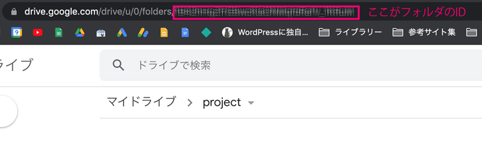

フォルダー作成時に発行されたURLの`~folders/`以下になります。
```
https://drive.google.com/drive/u/0/folders/【ID】
```

## プロジェクト登録用のスプシを作ろう！
スプレッドシートでプロジェクト管理用のシートを用意します。


今回はこんな構成にしました。

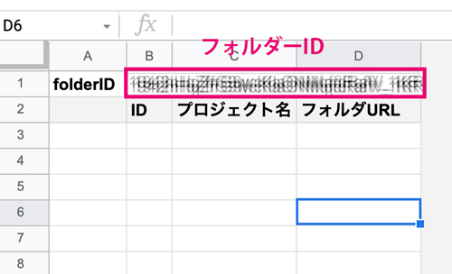

セルB1に「*project（親）フォルダーのID*」を入力しておきます。<br>
スプシは100行、D列まで表示し、シート名を*project*としておきました。


### スプシにはチェックボックスを設置できる
スプシにはチェックボックスを設置できるので先に設置しておきます。設置したいところにデータの入力規則をセット。

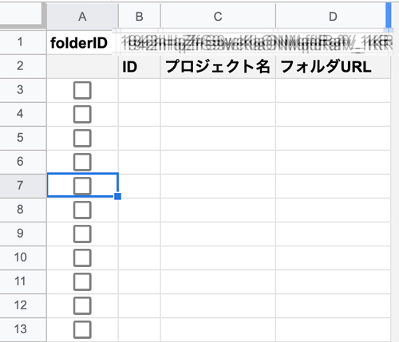


*条件*でチェックボックスを選択して、*無効なデータの場合*入力を拒否にチェックを入れておきます。

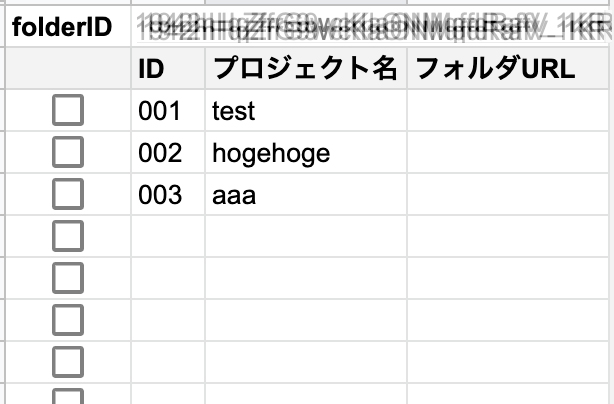

スプシにチェックボックスが実装できました!!

値
* チェック時...*TRUE*
* チェックなし...*FALSE*

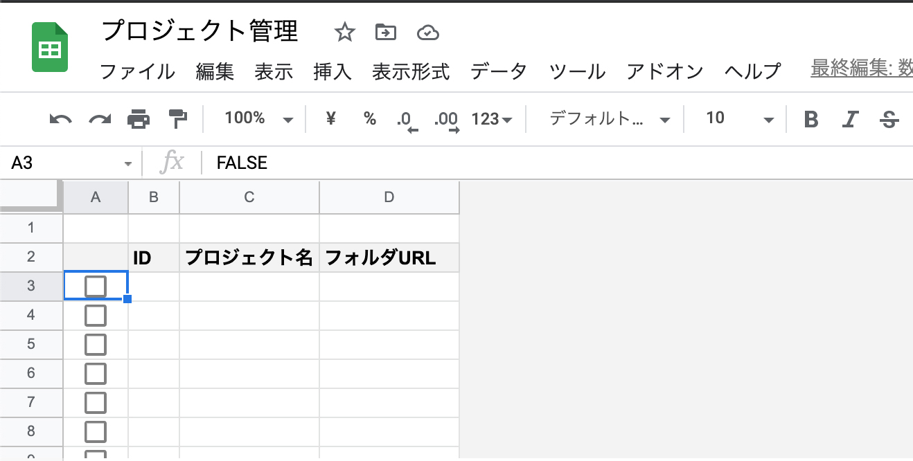


A列に一個チェックボックスができたら100行までコピペします。
### IDの連番を振る
C列にプロジェクト名が明記されたら、IDが振られる仕組みにします。

B列に以下コードを貼り付けます。
```
if(C3<>"",text(counta($B$2:B2),"000"),"")
```
text関数でゼロパディング（0埋め）表示します。

```
text([数字],"000")
```
今回3ケタにしましたがお好みのケタにしてください。

プロジェクトを追加したら、IDを追加できます。

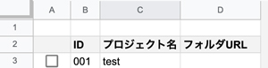

<div class="box">
<h4>触って欲しくない場所はシートを保護しておく</h4>
<p>チームで管理する場合はデータをうっかり変更されてしまわないよう、<em>データの保護</em>で編集できないようにします。</p>
<p>管理者権限を1アカウントとかにしてしまうといいです。</p>
<p>この場合はA列とC列以外は保護してしまいます。</p>
</div>

## フォルダーの自動生成処理
スクリプトエディタでフォルダーを自動生成するコードを書きます。

メニューの「ツール」>「スクリプトエディタ」を開きます。
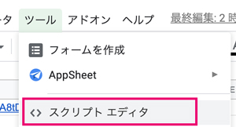

新規で立ち上げたApps Scriptページはこちら。

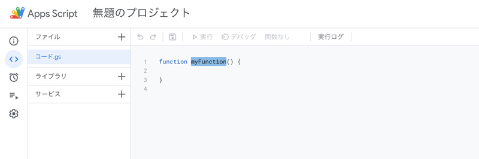

「*無題のプロジェクト*」で作られるので、管理しやすい名前に書き換えておきます。今回は「*プロジェクト管理*」としました。


関数名もデフォルトで`myFunction`になっているので`createProject`に書き換えます。

```js
function createProject() {
}
```

### シートのデータ取得

シート内のデータを取得します。B列の最後の列を参照し、最後の行を取得します。

```js
// 省略
const spreadsheet = SpreadsheetApp.getActiveSpreadsheet();
const sheet = spreadsheet.getSheetByName('project');
const last = sheet.getRange(2, 3).getNextDataCell(SpreadsheetApp.Direction.DOWN).getRow();
// 省略
```

取得したいデータの2行目から、連続してデータのあるセルの最後の列番号を取得できます。
```js
sheet.getRange(2, 3).getNextDataCell(SpreadsheetApp.Direction.DOWN).getRow();
```

<small>※ 処理を実行すると何度か権限の許可を求められます。<a href="#各種アクセス権限を許可しておく">各種アクセス権限を許可しておく</a>を参考にしてください。</small>

### 親フォルダーの取得
親フォルダー(project)を取得します。`getFolders`でさらにその直下のフォルダーも取得し、フォルダー名を配列`hasChilds`に格納しておきます。
```js
// 省略
const parentFolderId = sheet.getRange('B1').getValue();
const parentFolder = DriveApp.getFolderById(parentFolderId);　
const childFolders = parentFolder.getFolders();
let childrenList =[];

while(childFolders.hasNext()){
  childrenList.push(childFolders.next().getName());
}
// 省略
```

`getRange('B1')`は`getRange(2,1)`のような書き方でもOKです。

### 各行のデータを取得し、チェックが入っていればフォルダー作成する

for文で処理を回します。A列のチェックが入っているもののみの行を処理します。

今回はフォルダーの名前を`ID`+`_`+`名前`とします。

```js
// 省略
for(let i = 1; i<=last; i++){
  if(sheet.getRange(i, 1).getValue()=== true) {
    const name = sheet.getRange(i, 2).getValue() + '_' + sheet.getRange(i, 3).getValue();

    if(!hasChilds.includes(name)){
      let childrenFolder = parentFolder.createFolder(name);
    }
  }
}
// 省略
```
`includes`メソッドを使って配列`hasChilds`に、変数`name`と同じ値が含まれてないかチェックし、なければ`name`と同じ名前のフォルダーを作成します。

```js
hasChilds.includes(name)
```
### さらにフォルダーを作成する
さらにデフォルトで孫フォルダーをセットしておきます。
```js
  // 省略
  const gcFolders = ['議事録','受領物','納品物','その他'];
  // 省略
  if(!hasChilds.includes(name)){
    let childrenFolder = parentFolder.createFolder(name);
    for (var item in gcFolders){
      childrenFolder.createFolder(gcFolders[item]);
    }
  }
  // 省略
```
### スプシにフォルダー名とリンクを追加し、チェックを外す
`setValue`で値を挿入します。A列は初期値*FALSE*に戻して、D列にはリンク付きでフォルダー名を追加します。
```js
// 省略
if(!hasChilds.includes(name)){
  // 省略
  sheet.getRange(i, 4).setValue(`=HYPERLINK("${childrenFolder.getUrl()}","${name}")`);
  sheet.getRange(i, 1).setValue(`FALSE`);
}
// 省略
```
リンク付きの値を挿入するために`HYPERLINK`を使います。
```
HYPERLINK(リンク,名称)
```
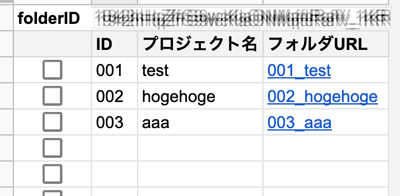

### 各種アクセス権限を許可しておく

プロジェクトを「保存」後、「実行」します。

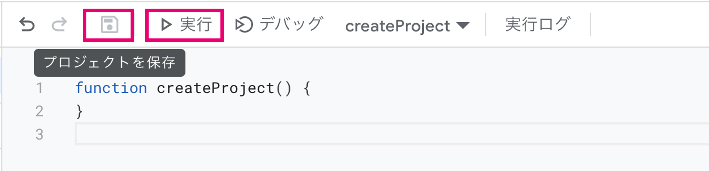

すると権限を求められますので「権限を確認」をクリック。

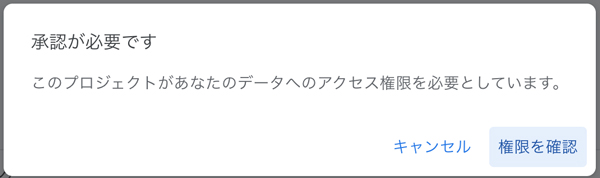

アカウントを選択。


「このアプリはGoogleでは確認されていません」って言われるので、*詳細*をクリックしてプロジェクト管理（アプリ名）に移動します。

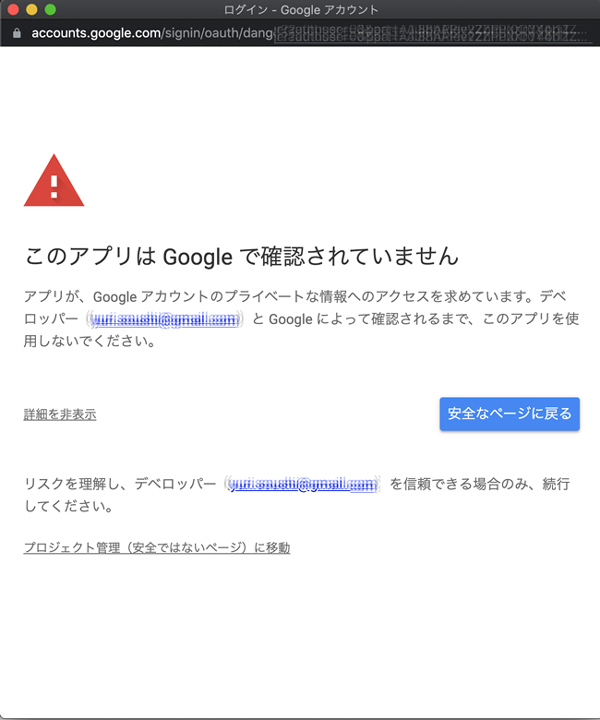

「Googleドライブのスプレッドシートの表示、編集、作成、削除」など許可しておきます。
<small>※ スプレッドシートからドライブにもアクセスするのでそちらの許可も必要です。</small>

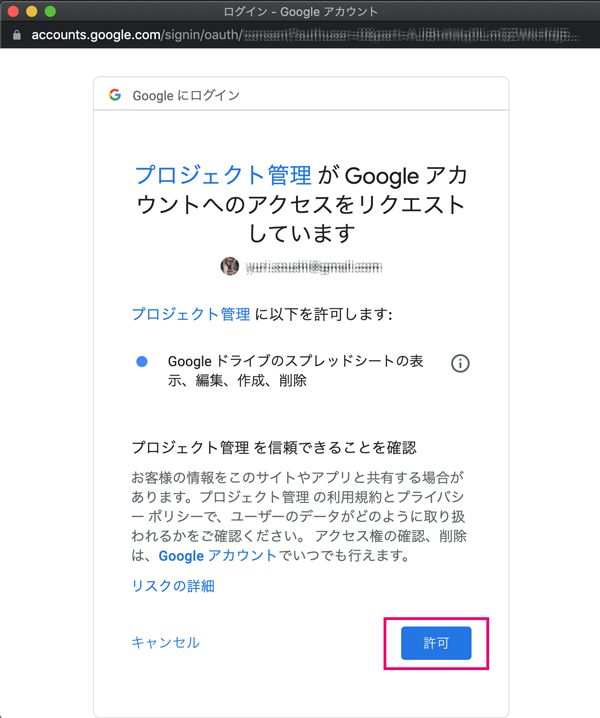


## フォルダーの自動生成処理を実行するメニュー追加
`addMenu`でメニューを追加します。
ラベル名は`name`、関数は`functionName`として配列に格納します。

```js
function setMenu(){
  //メニュー配列
  var myProject=[
    {name: "プロジェクト追加", functionName: "createProject"},
  ];
  SpreadsheetApp.getActiveSpreadsheet().addMenu("プロジェクト管理", myProject); //メニューを追加

}
```
`setMenu`に切り替えて実行します。
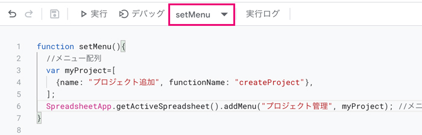

「プロジェクト管理」メニューが追加されます。これでスプシ上操作できるようになりました！！

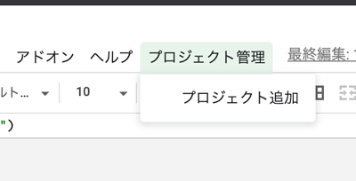


## すべてのコード
```js
function setMenu(){
  //メニュー配列
  var myProject=[
    {name: "プロジェクト追加", functionName: "createProject"},
  ];
  SpreadsheetApp.getActiveSpreadsheet().addMenu("プロジェクト管理", myProject); //メニューを追加
}

function createProject() {
  // シュートの取得
  const spreadsheet = SpreadsheetApp.getActiveSpreadsheet();
  const sheet = spreadsheet.getSheetByName('project');
  // 最終行取得
  const last = sheet.getRange(2, 3).getNextDataCell(SpreadsheetApp.Direction.DOWN).getRow();
  // 孫フォルダー
  const gcFolders = ['議事録','受領物','納品物','その他'];

  // Projegtフォルダー取得
  const parentFolderId = sheet.getRange('B1').getValue();
  const parentFolder = DriveApp.getFolderById(parentFolderId);　
  const childFolders = parentFolder.getFolders();

  // 既存フォルダーの名前を配列化
  let hasChilds =[];
  while(childFolders.hasNext()){
    hasChilds.push(childFolders.next().getName());
  }

  // 子フォルダー生成
  for(let i = 1; i<=last; i++){
    if(sheet.getRange(i, 1).getValue()=== true) {
      const name = sheet.getRange(i, 2).getValue() + '_' + sheet.getRange(i, 3).getValue();

      if(!hasChilds.includes(name)){
        let childrenFolder = parentFolder.createFolder(name);
        for (var item in gcFolders){
          childrenFolder.createFolder(gcFolders[item]);
        }
        // ドライブのリンクをシートに挿入
        sheet.getRange(i, 4).setValue(`=HYPERLINK("${childrenFolder.getUrl()}","${name}")`);
        // チェックボックスのチェックを外す
        sheet.getRange(i, 1).setValue(`FALSE`);
      }
    }
  }
}
```
## まとめ・少しコードを書けばGoogle系のツールは自動化可能！
煩わしいなあって思っていたフォルダー作成などの処理がボタン操作で可能になりました！

シートを見れば一目瞭然になりました。

少ない人数で仕事していると雑務もすべて自分でしないといけないので、少しでも減らして本業に集中したいものです。

この記事が皆さんの事務作業時短の一助となれば幸いです。

最後までお読みいただきありがとうございました。

### おまけ・配列の並べ替え
`getFolders`で取得したデータはせっかく連番idを付与しても更新などで順番が入れ替わります。

連番で配列が取得したい場合は、`sort`で並べ替えます。

```js
let array = [];
while(folders.hasNext()){
  let f = folders.next();
  array.push(f.getName()]);
}

array.sort(function(a, b) {
  if (a > b) {
    return 1;
  }else {
    return -1;
  }
});
```
