タグマネージャー（通称タグマネ）はサイトが重くなるという理由で今まで使ってませんでした。

計測するものが増え今回思い切ってタグマネに切り替えました。

## タグマネージャーとは？
> タグマネージャーとは、タグを一括で管理するツールのこと。データを取得するためにタグを設置します。

本来タグはこんな感じで、直書きで実装します。ちょっとコードを書きなれていない方にはハードルが高いですよね。。。
```html
<a href="tel:000-0000-0000" onclick="gtag('event', 'click', {'event_category': 'button','event_label': 'tell2'});"><i class="fas fa-phone-volume"></i> 000-0000-0000</a>
```

こんな面倒なコードを書くことなく、タグマネージャーの管理画面からタグを実装できます。

<div class="box"><em>タグマネージャーは計測用のタグを手軽に設置し一元管理できるツール。</em></div>

## タグマネージャーアカウント作成後、コンテナを作る
アカウントを作成し、コンテナを作成します。

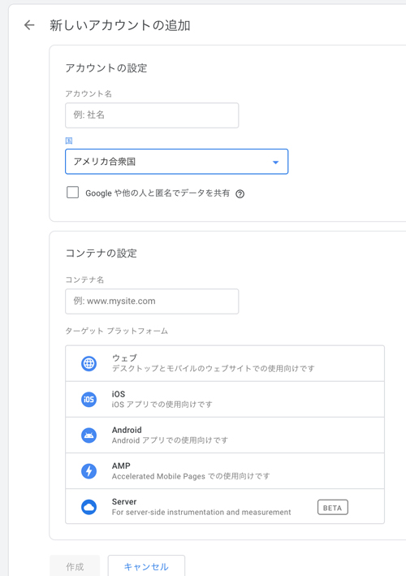

### アカウント作成

* アカウント名 ... 組織名がベストかと
* 国 ... サービスを提供する国で

### コンテナ設定
* コンテナ名 ... サイト名とか
* プラットフォーム ... ブログなどはウェブサイトでOK。特殊じゃない限りこれで大丈夫だと思います。

<br>これでタグマネージャー設置用のコードが発行されます。

インストールとか言ってますがようは指定された場所にコードを貼るだけ。

headタグの上部とbodyタグの直後の2箇所にそれぞれコードを貼り付けます。

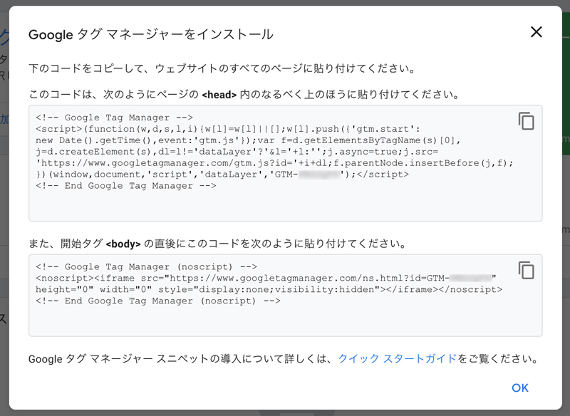

```html
<html>
<head>
<!--1個目のコードはできるだけ上の方に設置-->
.
.
.
</head>
<body>
<!--２個目のコードは<body>の直後に-->
.
.
.
```

もしこのコードを再取得したいときは、タグマネージャーのIDをクリックすると確認可能です。
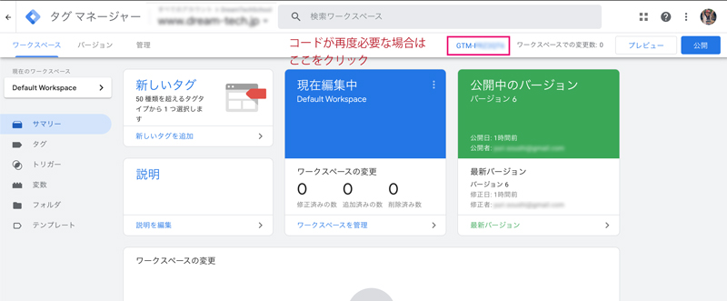

<div class="box"><em>WordPressなどのプラグインやテーマによってはタグマネージャーのIDさえあれば設置可能のこともあります。</em></div>

## タグを設置できたらGAと連携
早速Google Analyticsと連携します。今回はユニバーサルアナリティクス（旧）とGA4（新）の連携方法をご紹介しておきます。

<small>※ 私はユニバーサルアナリティクスとGA4のデータを併用して計測しています。</small>

### ユニバーサルアナリティクスと連携する
タグを追加します。

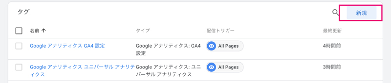

タグの種類からユニバーサルアナリティクスを選択します。トラッキングタイプはページビューでOKです。

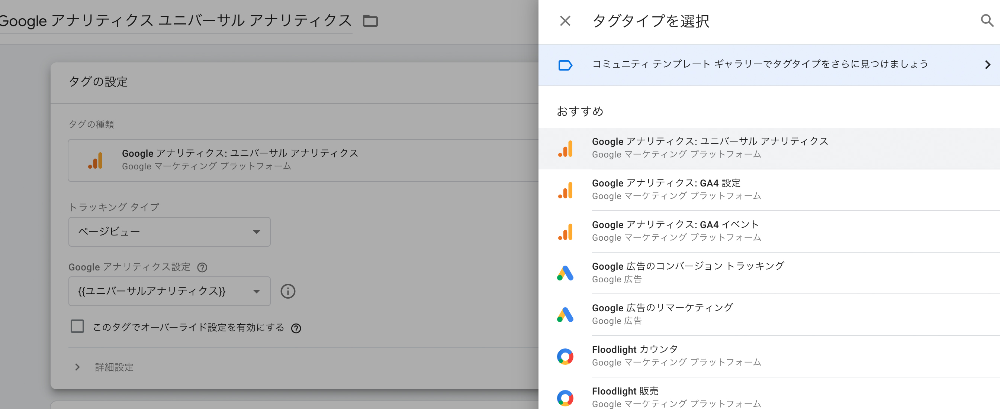

Googleアナリティクス設定で新しい変数を定義します（後々イベントトラッキングなどで使用するため）。

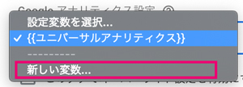

ユニバーサルアナリティクスのトラッキングIDはGoogle Analyticsの管理（歯車マーク）プロパティから確認できます。
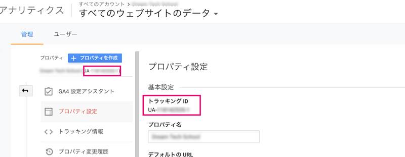

トラッキングIDをコピーしたら、変数のトラッキングIDに貼り付けます。ユニーバーサルアナリティクスIDとかわかりやすい名前で保存しておきます。

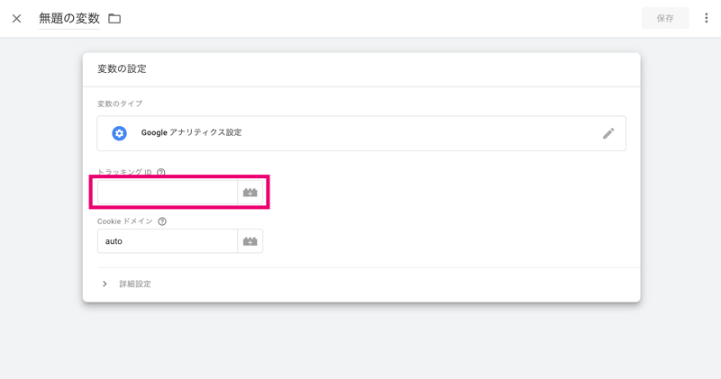

最後にトリガーを設定します。*All Pages*でOKです。

必要であればタグ名を変更して保存します。

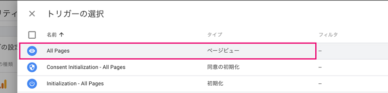

あとはプレビューをクリックし反映しているか確認します。


*Tags Fired（発火しているタグ）*のなかに設置したタグ名が含まれていればOK!!!

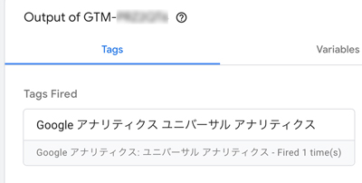

念の為、アナリティクスの管理画面からリアルタイムで確認してみます。

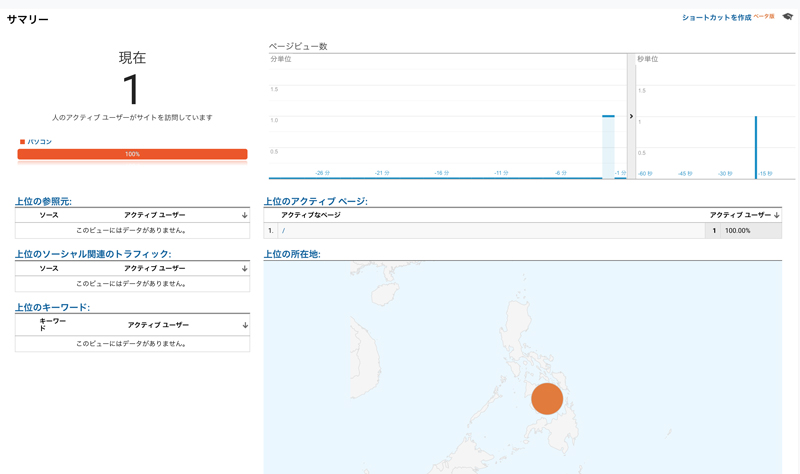

<div class="box"><em>反応しないときはページをリロードするなどしてみましょう。反映しない場合は拡張機能のオプトアウト、IP除外なども確認してみましょう。</em></div>

### GA4と連携する
次はGA4と連携しましょう。ユニバーサルアナリティクスよりもっと簡単です。

ただ、トラッキングIDのある場所がややこしいので注意です。<br>
設定（歯車マーク）からプロパティ、データストリームで指定のストリームを選び、詳細の中に測定IDがあります。

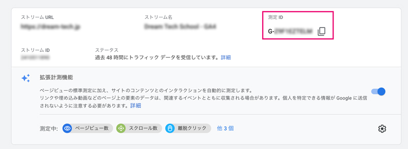

タグを追加し、タグの種類を*Googleアナリティクス:GA4*設定にします。

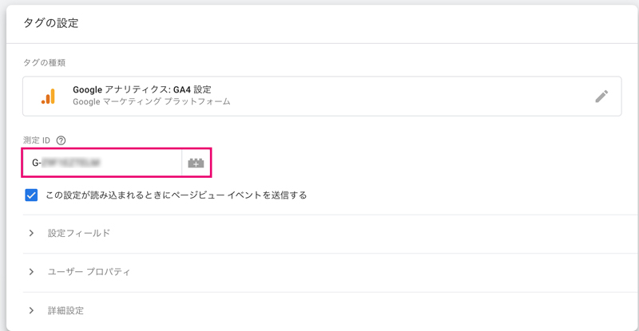

ユニバーサルアナリティクス同様配信トリガーを*All Pages*に設定したらGA4などわかりやすい名前をつけて保存します。

プレビューでタグが発火するか確認して問題なさそうであれば公開、さらにGA4のリアルタイム画面で反映しているか確認しておきましょう。

## イベントの登録
イベントをタグマネで登録してみましょう！ユニバーサルアナリテティクスとGA4両方紹介します。

今回は、携帯からの電話発信とコンバージョンボタンのクリック数を計測する方法をご紹介します。

### 組み込み変数を設定する（共通）
左のメニューの「変数」から設定を開き、必要な組み込み変数を追加しておきます。

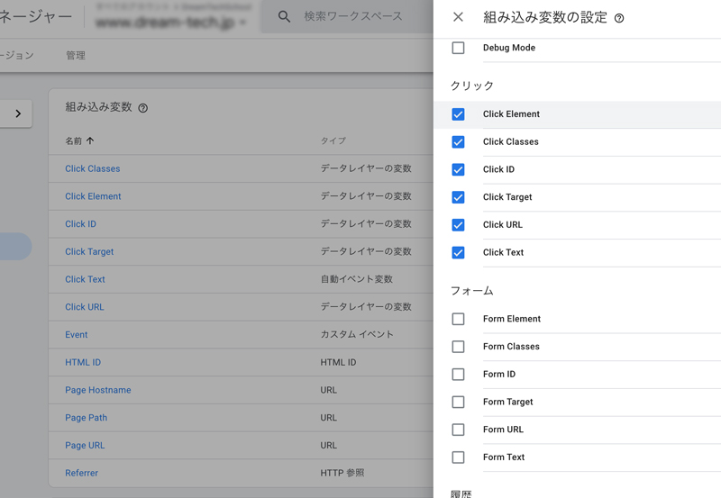

|変数|詳細|
|-|-|
|*Click Classes*|クリックされる要素のクラス|
|*Click Element*|クリックされる要素名|
|*Click ID*|クリックされる要素のID|
|*Click Target*|クリックされる要素のtarget属性|
|*Click Text*|クリックされる要素のテキスト|
|*Click URL*|クリックされる要素のURL|

### トリガーを設定する（共通）
携帯からの電話発信とコンバージョンボタンのトリガーを設定します。

どちらもトリガータイプをリンククリックとし一部のリンククリックにチェックします。

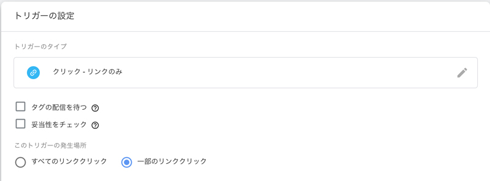

条件を設定します。タグに含まれるリンクやクラスを組み合わせて、一致する要素のクリックされた時をトリガーとします。<br>条件は「含む」か「一致」でいいと思います。

*電話発信*
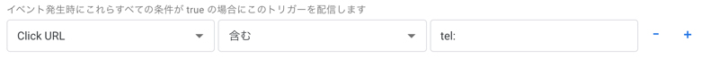

*CVクリック*
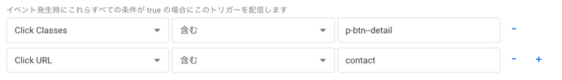


## イベント用タグの登録
イベント用のタグを登録します。

### ユニバーサルアナリティクスでのタグ設定

タグの種類はユニバーサルアナリティク、ストラッキングタイプをイベントに設定します。

|ディメンション名|補足と詳細|
|-|-|
|カテゴリ|イベントのカテゴリ名です。一般的に行為に対する対象物です。|
|アクション|ユーザーのアクション|
|ラベル|計測するデータの最小単位など|

今回2つともボタンなので、カテゴリはbuttonとしました。

Googleアナリティクス設定でトラッキングIDが格納されている変数を選択します。

それぞれトリガーも設定します。

*電話発信*<br>
アクションは*call*、ラベルは場所`{{Page URL}}`を取得することにしました。

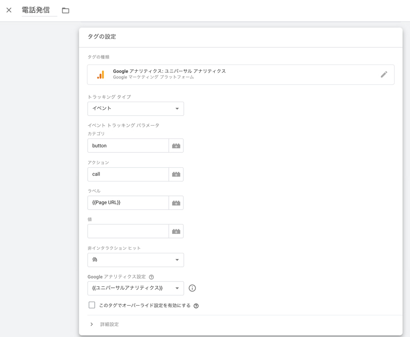

*CVボタンクリック*<br>
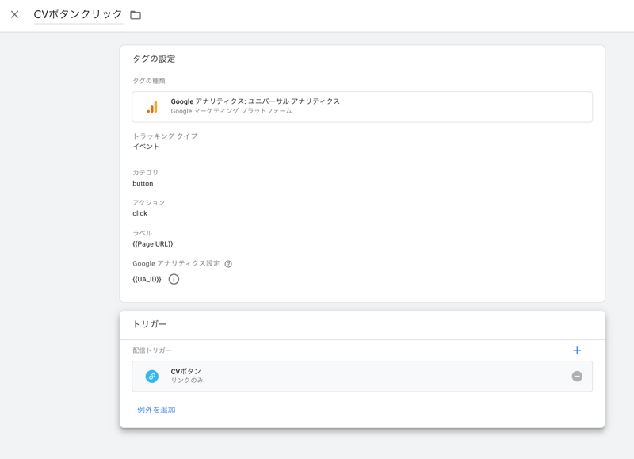

プレビューで実際に試してみて*Tags Fired*にタグが移動したら成功です。併せてアナリティクス管理画面のリアルタイムでも確認しましょう。

### GA4でのタグ設定
タグの種類を*Google アナリティクス: GA4 イベント*とし、設定タグにトラッキング用で作成したGA4用のタグをセットします。

イベント名とタグ名は間違えそうなので同じにしておくのが良さそうです。

*電話発信GA4*<br>

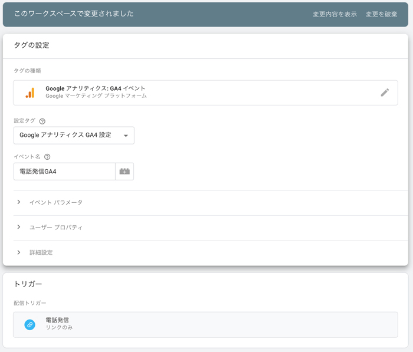

*CVボタンクリックGA4*<br>
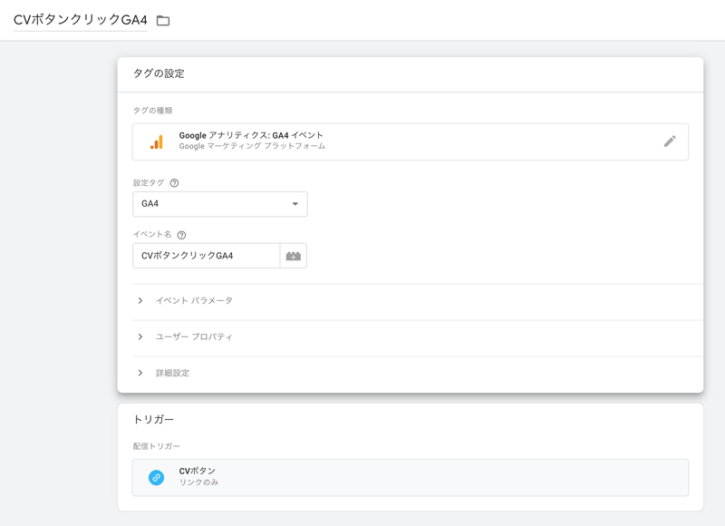

## まとめ・GA4とタグマネージャーの連携はカンタン
やってみるとタグマネージャーとGA4の連携はユニバーサルアナリティクスよりもカンタンでした。

まだまだ改善中のGA4。数日前にメニューがいつの間に関わっていたりしたので、今度最新版の見方などをまとめようと思います。

皆さんのSEOライフの一助となれば幸いです。

最後までお読みいただきありがとうございました。
