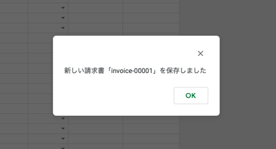
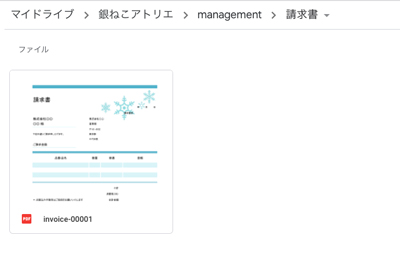
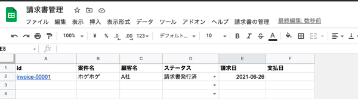
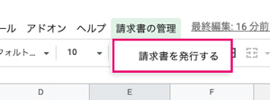
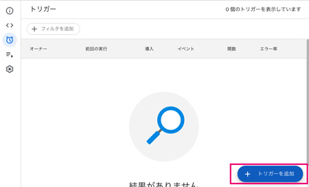
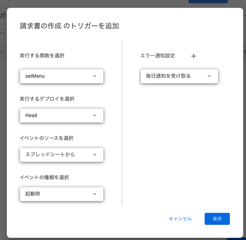
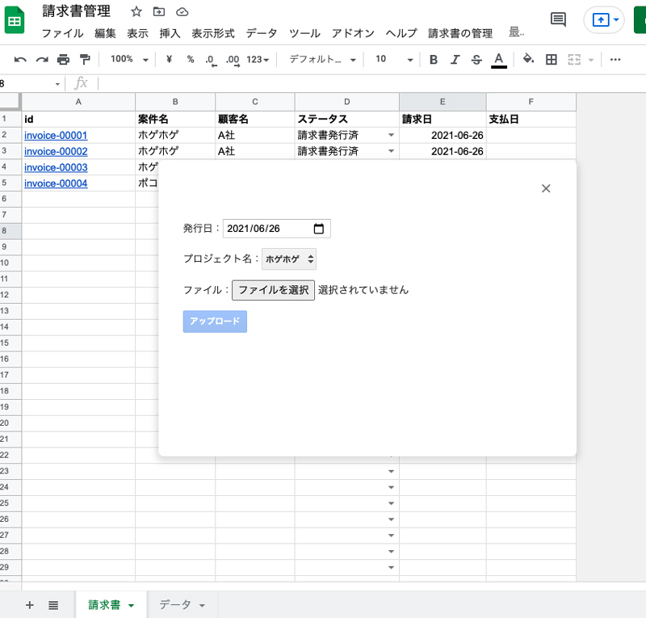

## スプシからファイルをアップロードしてドライブに保存するまでの大まかな作業の流れ

この記事は、[【GAS】スプシからファイルアップロードし、ドライブに保存する・UI編]("/blogs/entry475/)の続編です。


ファイルアップロード用のコードを書きます。手順としては以下の流れです。

1. スプシを準備（済）
1. GASのプロジェクト作成（済）
2. アップロード用のモーダルパーツを作成（UI追加）（済）
3. バリデーションで保存するファイルのサイズやタイプを判定
4. Googleドライブでファイルを保存しリネーム
5. スプシにファイル情報を書き出す
6. メニュー操作で保存処理を常に実行できるようにする


<small>※ （済）は前回の記事で紹介しています。</small>

<a class="article-link" href="/blogs/entry475/">
<section><div class="article-link__img"></div><div class="article-link__main">
<div class="article-link__main__title">【GAS】スプシからファイルアップロードし、ドライブに保存する・UI編</div>
<p class="description">プログラミングで自動化してヒューマンエラーやルールのブレをを減らしたい！Google Apps Scriptを使ってスプシ（Googleスプレッドシート）から･･･</p>
<p>
<time datetime="2021-06-24">2021.06.24</time>
</p>
</div>
</section>
</a>

請求書の整理を例にとって進めていきます。

<div class="msg-baloon">
<p>かみーゆ</p>
<p>この記事は「人のやる作業を減らしたい」、「書類を管理するためにルールを厳格に守りたい」、「個人で会社や仕事を切り盛りしている」方にオススメです。</p>
</div>

<br>フォルダー自動生成に関しては、こちらの記事を参考に！

<a class="article-link" href="/blogs/entry470/">
<section><div class="article-link__img"></div><div class="article-link__main">
<div class="article-link__main__title">Google Apps Script（GAS） でスプシからドライブにフォルダー自動生成</div>
<p class="description">GASを使ってスプレッドシートからGoogleドライブにフォルダーを自動追加する方法の紹介です･･･</p>
<p>
<time datetime="2021-06-08">2021.06.08</time>
</p>
</div>
</section>
</a>

## Googleドライブにファイルを格納する
ファイルを格納するフォルダーを作ってコードを書いていきます。

### 請求書を格納するフォルダーを作る
請求書を格納するためのフォルダーをGoogleドライブ上に作成します。

今回はフォルダー名を*請求書*としました。IDをメモっておきます。URLのfolders/以降がIDです。

`https://drive.google.com/drive/u/0/folders/【ID】`


### ファイルを格納するコード
`sendForm`を書き換えます。ファイルを取得し、フォルダーに格納するまでのコードです。
```js
function sendForm(form) {
  const folder = DriveApp.getFolderById(【フォルダーID】);
  const file = form.file;

  if(file) {
    const doc = folder.createFile(file);
  }
}
```

### ファイルをリネームする
ファイルを請求書用のIDでリネームします。

*invoice + -（ハイフン） + 五桁の数字*としました。

```
invoice-00001
```

ID生成のコードはこちらです。スプシに登録された請求書の数を数えてIDを作っていきます。

```js
  const spreadsheet = SpreadsheetApp.getActiveSpreadsheet();
  const accounting = spreadsheet.getSheetByName('請求書');
  const num = (accounting.getRange(2, 1).getValue()==='')? 1 : accounting.getRange(1, 1).getNextDataCell(SpreadsheetApp.Direction.DOWN).getRow();
  const fileName = 'invoice-'+("0000" + (num)).slice( -5 );
```
`getNextDataCell(SpreadsheetApp.Direction.DOWN).getRow()`は2行以上連続でセルに値がないと取得できません。

ファイルが未格納の場合は1にしておきます。
```
(accounting.getRange(2, 1).getValue()==='')? 1 : accounting.getRange(1, 1).getNextDataCell(SpreadsheetApp.Direction.DOWN).getRow();
```
生成したIDでリネームします。`setName`でファイル名を変更できます。保存が終了したら`Browser.msgBox`を使ってメッセージボックスを表示します。
```js
function sendForm(form) {
  const folder = DriveApp.getFolderById(【フォルダーID】);
  const file = form.file;

  if(file) {
    const spreadsheet = SpreadsheetApp.getActiveSpreadsheet();
    const accounting = spreadsheet.getSheetByName('請求書');
    const num = (accounting.getRange(2, 1).getValue()==='')? 1 : accounting.getRange(1, 1).getNextDataCell(SpreadsheetApp.Direction.DOWN).getRow();
    const fileName = 'invoice-'+("0000" + (num)).slice( -5 );
    var doc = folder.createFile(file);
    doc.setName(fileName);
    Browser.msgBox('新しい請求書「' + fileName + "」を保存しました");
  }
}
```

実行すると権限を求められるので許可します。許可の仕方が分からない方は前回の記事[権限の許可](/blogs/entry475/#権限の許可)を確認してください。

処理が終わると*新しい請求書「invoice-xxxxx」を保存しました*と表示。



リネームされたファイルがちゃんと指定されたGoogleドライブのフォルダー内に格納されます。



できた！！

<div class="msg-baloon">
<p>かみーゆ</p>
<p>ドライブには同じ名前のファイルがアップロードできますよね？<br>ファイル名を自動でつけると重複することがないので後々困らずにすみますよ！</p>
</div>

## スプシにファイル情報を書き出す
ファイル以外のデータも取得します。

```js
const file = form.file;//ファイルデータ
const date = form.date;//日時データ
const project = form.project;//プロジェクト名
var client = "";//顧客
```
顧客名はデータシートからデータを引っ張ってきて照合します。

```js
const data = spreadsheet.getSheetByName('データ');
const projectsLastRow = data.getRange(1, 1).getNextDataCell(SpreadsheetApp.Direction.DOWN).getRow();//最終行を取得
const clients = data.getRange(2, 1, projectsLastRow-1, 2).getValues();//プロジェクトと顧客の列のみ取得

//プロジェクト名から顧客名を割り出す
for(var i in clients){
  if(clients[i][0] === project) client = clients[i][1];
}
```
それぞれデータができたら、シートに出力します。
```js
  accounting.getRange(num + 1, 1).setValue('=HYPERLINK("' + doc.getUrl() + '","' + fileName + '")');
  accounting.getRange(num + 1, 2).setValue(project);
  accounting.getRange(num + 1, 3).setValue(client);
  accounting.getRange(num + 1, 4).setValue('請求書発行済');
  accounting.getRange(num + 1, 5).setValue(date);
```
実行するとこんな感じになります。



<div class="msg-baloon">
<p>かみーゆ</p>
<p>請求書などのファイルを一元管理！<br>IDのリンクからファイルに飛べるので、ファイルをいちいちドライブで探す必要がなくなります！</p>
</div>

## sendFormのすべてのコード
ファイルをリネームしてドライブに保存し、スプシに書き出すまでの処理です。
```js
function sendForm(form) {
  const folder = DriveApp.getFolderById([フォルダーID]);
  const file = form.file;

  //ファイルを取得したら。
  if(file) {
    const spreadsheet = SpreadsheetApp.getActiveSpreadsheet();
    const accounting = spreadsheet.getSheetByName('請求書');
    const num = (accounting.getRange(2, 1).getValue()==='')? 1 : accounting.getRange(1, 1).getNextDataCell(SpreadsheetApp.Direction.DOWN).getRow();
    const fileName = 'invoice-'+("0000" + (num)).slice( -5 );
    const doc = folder.createFile(file);
    doc.setName(fileName);
    Browser.msgBox('新しい請求書「' + fileName + "」を保存しました");

    //スプシに書き出すデータ
    const date = form.date;
    const project = form.project;
    var client = "";

    const data = spreadsheet.getSheetByName('データ');
    const projectsLastRow = data.getRange(1, 1).getNextDataCell(SpreadsheetApp.Direction.DOWN).getRow();
    const clients = data.getRange(2, 1, projectsLastRow-1, 2).getValues();

    for(var i in clients){
      if(clients[i][0] === project) client = clients[i][1];
    }

    //スプシに書き出し
    accounting.getRange(num + 1, 1).setValue('=HYPERLINK("'+doc.getUrl()+'","'+fileName+'")');
    accounting.getRange(num + 1, 2).setValue(project);
    accounting.getRange(num + 1, 3).setValue(client);
    accounting.getRange(num + 1, 4).setValue('請求書発行済');
    accounting.getRange(num + 1, 5).setValue(date);
  } else {
    Browser.msgBox('保存できませんでした');
  }
}
```

## メニュー操作で保存処理を常に実行できるようにする

メニューを表示するための関数を`コード.gs`（GAS）に追記します。

`functionName`には、前回[【GAS】スプシからファイルアップロードし、ドライブに保存・UI編](/blogs/entry475)で作った関数`showMdal`をセットします。

```js
function setMenu(){
  const menu = [
    {name: "請求書を発行する", functionName: "showModal"},
  ];
  SpreadsheetApp.getActiveSpreadsheet().addMenu("請求書の管理", menu);
}
```

`setMenu`を実行します。


スプシ側で確認するとちゃんとメニューができました！！


さらにメニューをスプシ側で常に表示できるようにします。

トリガーから「トリガーを追加」を選びます。



関数にsetMenuをセット。あとは、デフォルトのままで大丈夫です。



これでスプシ起動時にメニューが表示され、いつでもファイルをアップロードできるようになりました。



## まとめ・GASはやっぱり便利だった
今回は前回のアップロードフォームのパーツ表示に続き、ファイルにバリデーションをかけてアップロードし、スプシにデータを書き出す方法をご紹介いたしました。

<div class="msg-baloon">
<p>かみーゆ</p>
<p>普段の事務作業を少しでも減らしたくてGASを使ってみたら便利だったのでこの記事を書きました</p>
</div>

皆さんの事務作業軽減の一助となれば幸いです。

最後までお読みいただきありがとうございました。
